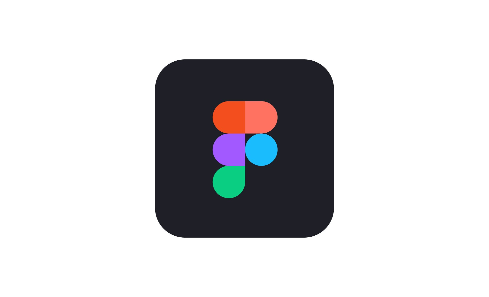

**Document Information:**

|                   | Information |
| ----------------- | ----------- |
| Document Owner    | Mouatassime Seiv|
| Creation Date     | 2024/05/21  |
| Last Update Date  | 2024/06/04  |

### Mandatory Tools for the Project :

### 
                             FIGMA :

Figma is a graphics editing and prototyping program . Figma is mainly used for digital design: in other words, for the design of websites and application interfaces.



| **Advantages**                                                | **Inconveniences**                                     |
|---------------------------------------------------------------|--------------------------------------------------------|
| **Cloud-based platform**                                      | **Dependent on internet connection**                   |
| Accessible from anywhere with an internet connection         | Requires a stable internet connection to function      |
| **Real-time collaboration**                                   | **Performance issues on large projects**               |
| Multiple users can work on the same file simultaneously       | Can become slow or laggy with very large files         |
| **Cross-platform compatibility**                              | **Limited offline capabilities**                       |
| Works on Windows, macOS, Linux, and web browsers              | Limited functionality when not connected to the internet|
| **Design and prototyping in one tool**                        | **Subscription cost for premium features**             |
| Allows both designing and prototyping without switching tools | Free version has limitations, premium plans can be expensive |
| **Intuitive and user-friendly interface**                     | **Steeper learning curve for advanced features**       |
| Easy to learn for beginners, with a clean and organized UI    | Advanced features and plugins require more time to master |
| **Component and style management**                            | **Plugin ecosystem still growing**                     |
| Efficient reuse of components and consistent styling          | Although growing, the number of plugins is still limited |
| **Version control and history**                               | **Browser dependency**                                 |
| Maintains a history of changes, allowing easy reversion       | Performance and experience can vary across different browsers |
| **Strong community and resource support**                     | **File management complexity**                         |
| Large community with extensive tutorials and resources        | Managing multiple projects and files can become cumbersome |
| **Integrations with other tools**                             | **Limited animation capabilities**                     |
| Integrates well with tools like Slack, Zeplin, and more       | Basic animation features compared to dedicated tools like After Effects |
| **Scalable for teams and enterprises**                        | **Data privacy concerns**                              |
| Suitable for both small teams and large organizations         | Storing sensitive design data on a third-party server can be a concern |
| **Frequent updates and new features**                         | **Complexity in handling design systems**              |
| Regularly updated with new features and improvements          | Managing and updating large design systems can be challenging |


### 
                            Flutter: 
Flutter uses the programming language Dart and compiles into machine code. Host devices understand this code, which ensures a fast and effective performance.* 


| **Advantages**                                                | **Inconveniences**                                   |
|---------------------------------------------------------------|------------------------------------------------------|
| **Cross-platform development**                                | **Large app sizes**                                  |
| Write one codebase for iOS, Android, web, and desktop         | Flutter apps tend to have larger file sizes          |
| **Fast development**                                          | **Limited third-party libraries**                    |
| Hot reload feature allows for quick code changes and testing | Although growing, Flutter's ecosystem is smaller     |
| **High performance**                                          | **Limited support for certain native features**      |
| Compiled to native ARM code for fast execution               | Some platform-specific features may not be supported |
| **Rich set of pre-designed widgets**                         | **Learning curve for Dart language**                 |
| Provides extensive widgets that are customizable             | Developers need to learn Dart, which is less common  |
| **Consistent UI across platforms**                            | **Performance can vary on different platforms**      |
| Ensures uniform look and feel on different OS                 | Optimization needed for each platform individually   |
| **Strong community and corporate support**                   | **More resource-intensive**                          |
| Backed by Google and has an active developer community       | Can consume more CPU and memory compared to native   |
| **Open-source and free**                                     | **Fewer UI templates compared to native SDKs**       |
| Free to use with a wealth of community-contributed packages  | Limited in-built UI templates, requiring custom designs |
| **Customizable and flexible UI**                             | **Some platform-specific look and feel issues**      |
| Enables highly tailored and dynamic UIs                      | May not perfectly match the native appearance        |
| **Access to native features through plugins**                | **Still maturing and evolving framework**            |
| Large repository of plugins for native functionalities       | Rapid changes can introduce instability              |
| **Strong documentation and resources**                       | **Potential for changes and deprecations**           |
| Comprehensive official documentation and tutorials available | Features may be deprecated as the framework evolves  |


### Tech Plan for Adopte Un Candidat Using Flutter (Frontend Only)

#### 1. Project Scope and Objectives
**Objectives**:
- Develop a cross-platform mobile recruitment application using Flutter.
- Implement a "Tinder-style" matching process focusing on soft skills.
- Ensure the anonymization of candidates and companies.
- Provide features for messaging, profile management, and secure data handling.

**Scope**:
- User Authentication (Registration, Login, Password Recovery)
- Candidate and Company Profile Management
- Soft Skills Selection and Matching Algorithm
- Messaging System
- Anonymization and Data Security
- Multi-platform Accessibility (iOS and Android)

#### 2. Technology Stack
**Frontend**:
- **Mobile App**: Flutter

**Backend**:
- **Not Included**: Mock data and local storage will simulate backend functionality.

**Services and Tools**:
- **Local Storage**: Hive or SharedPreferences for persistent local storage.
- **State Management**: Provider, Riverpod, or Bloc.
- **Network Requests**: Dio or http package (for future backend integration).
- **Authentication**: Firebase Authentication (for future backend integration).
- **Push Notifications**: Firebase Cloud Messaging (FCM) for notifications.
- **UI Design**: Figma and Flutter for UI/UX design and prototyping.

#### 3. Architecture Design
**App Structure**:
- **Models**: Data structures for users, profiles, messages, and skills.
- **Services**: Simulated services for authentication, profile management, matching, and messaging.
- **State Management**: Provider, Riverpod, or Bloc to manage application state.
- **UI Components**: Modular and reusable components for different parts of the app.

**Data Flow**:
1. **Local Storage**: Store user data, profiles, and messages locally.
2. **State Management**: Manage the application state using a chosen state management solution.
3. **Mock Services**: Simulate backend responses and interactions.
4. **UI Components**: Render data and handle user interactions.

#### 4. Implementation Plan
**Phase 1: Requirements and Planning**
- Define detailed requirements and use cases.
- Create technical specifications and user stories.
- Design UI/UX mockups using Figma.

**Phase 2: Project Setup**
- Set up the Flutter project structure.
- Install necessary packages (Provider, Riverpod, Bloc, Dio, etc.).

**Phase 3: UI Development**
- Implement authentication screens (login, registration, password recovery).
- Develop user profile management and soft skills selection UI.
- Create the matching interface inspired by Tinder's swipe functionality.
- Implement messaging functionality.

**Phase 4: State Management and Local Storage**
- Set up state management using Provider, Riverpod, or Bloc.
- Implement local storage using Hive or SharedPreferences.
- Simulate backend services for authentication, profile management, matching, and messaging.

**Phase 5: Integration and Testing**
- Integrate UI components with state management and local storage.
- Perform unit and integration testing for each module.
- Conduct user acceptance testing (UAT) to ensure all functionalities meet requirements.

**Phase 6: Deployment**
- Prepare the app for deployment on Google Play Store and Apple App Store.
- Set up Firebase Cloud Messaging for push notifications.
- Configure app permissions and settings for both iOS and Android.

**Phase 7: Post-Launch**
- Monitor application performance and error logs.
- Collect user feedback and iterate on features.
- Implement additional features based on user needs and market trends.

#### 5. Project Timeline
**Week 1**: Requirements gathering, planning, and design.

**Week 2-3**: Project setup, UI development, and state management.

**Week 4**: Integration and testing.

**Week 5**: Deployment preparation and app store submissions.

**Week 6**: Post-launch support and feature enhancements.

#### 6. Team Structure

| Photo                                                                                                                                     | Name            | Role              | LinkedIn                                                           |
| ----------------------------------------------------------------------------------------------------------------------------------------- | --------------- | ----------------- | ------------------------------------------------------------------ |
| [](https://github.com/PaulNowak36)    | Paul NOWAK    | Project Manager   | [LinkedIn](https://www.linkedin.com/in/paul-nowak-0757a61a7/)          |
| [](https://github.com/Bistrel2002)          | Vivien Bistrel TSANGUE CHOUNGOU    | Program Manager   | [LinkedIn](https://www.linkedin.com/in/bistrel-tsangue-603635261/)    |
| [](https://github.com/seiv007) | Mouatassime SEIV | Technical Leader  | [LinkedIn](https://www.linkedin.com/in/moutassime-seiv-9542171a9/) |
| [](https://github.com/Amakran2003)        | Abderrazaq MAKRAN      | Technical Writer  | [LinkedIn](https://www.linkedin.com/in/abderrazaq-makran/)      |
| [](https://github.com/mathislebel)          | Mathis LEBEL   | Quality Assurance | [LinkedIn](https://www.linkedin.com/in/mathis-lebel-429114293/)   |

This tech plan outlines the development, testing, and deployment strategy for the Adopte Un Candidat project using Flutter. The focus is on creating a user-friendly and secure recruitment application, with UI/UX designs and prototypes created using Figma.


### Tools and Software used

<div style="display: flex; flex-wrap: wrap; align-items: center; gap: 20px;">

  <div style="text-align: center;">
    
  </div>
  <div style="text-align: center;">
    
  </div>
  <div style="text-align: center;">
    
  </div>
  <div style="text-align: center;">
    
  
  </div>
  <div style="text-align: center;">
    
  </div>   
  </div>
</div>


### To develop a mobile app in Flutter that connects companies with employees in a manner similar to Tinder, you will need a combination of libraries to handle various functionalities like UI, state management, backend services, real-time communication, and more. Here’s a comprehensive list of the main libraries you should use:


### Core Libraries
1. **Flutter SDK**: The core framework for building the app.

### State Management
2. **Provider** or **Riverpod**: These are the most popular state management solutions in Flutter. They help manage the state of your application efficiently.

### Networking and Backend
3. **Dio** or **http**: For making HTTP requests to your backend API.
4. **Firebase**: For backend services including authentication, real-time database, cloud storage, and more.
   - **firebase_core**
   - **firebase_auth**
   - **cloud_firestore**
   - **firebase_storage** (for handling image uploads)

### UI Components
5. **Flutter Tinder Cards (flutter_tindercard)**: For creating the swipeable card interface similar to Tinder.
6. **Image Picker**: For handling image uploads from the user's device.
7. **Flutter Form Builder**: For building and validating forms.

### Real-time Communication
8. **Socket.io Client**: For enabling real-time chat functionality.

### Notifications and Animations
9. **Flutter Local Notifications**: For handling in-app notifications.
10. **Animations Package**: For creating smooth and responsive animations.

### Location Services (if needed)
11. **Geolocator**: For handling location-based services.
12. **Google Maps Flutter**: For integrating maps and location-based features.

### Example Setup
Here’s how you can include these dependencies in your `pubspec.yaml` file:

```yaml
dependencies:
  flutter:
    sdk: flutter
  provider: ^6.0.0
  dio: ^5.0.0
  firebase_core: ^2.5.0
  firebase_auth: ^4.5.0
  cloud_firestore: ^4.5.0
  firebase_storage: ^12.5.0
  google_maps_flutter: ^3.5.0
  geolocator: ^9.0.0
  flutter_tindercard: ^0.3.0
  image_picker: ^1.0.0
  socket_io_client: ^2.0.0
  flutter_local_notifications: ^12.5.0
  animations: ^4.5.0
  flutter_form_builder: ^7.5.0
```

### Basic Workflow

1. **Setup Firebase**: Initialize Firebase in your Flutter project for authentication, real-time database, and storage.
2. **State Management**: Use Provider or Riverpod to manage the state of your application.
3. **Create Swipeable Cards**: Implement swipeable cards using `flutter_tindercard` for company and employee profiles.
4. **Networking**: Use Dio or http to handle API requests to your backend services.
5. **Real-time Communication**: Implement Socket.io for real-time chat and updates between companies and employees.
6. **Form Handling**: Use Flutter Form Builder to create and validate forms for user profiles, job applications, etc.
7. **Image Uploads**: Use Image Picker and Firebase Storage to handle profile image uploads.
8. **Location Services**: Integrate Geolocator and Google Maps Flutter if your app requires location-based features.
9. **Notifications**: Use Flutter Local Notifications to send notifications to users about new matches, messages, etc.
10. **Animations**: Use the Animations package to enhance the user experience with smooth transitions and animations.

### Sample Implementation

Here’s a brief example of how you might implement some of these functionalities:

**Initialize Firebase in `main.dart`**:

```dart
void main() async {
  WidgetsFlutterBinding.ensureInitialized();
  await Firebase.initializeApp();
  runApp(MyApp());
}
```

**State Management with Provider**:

```dart
class MyApp extends StatelessWidget {
  @override
  Widget build(BuildContext context) {
    return MultiProvider(
      providers: [
        ChangeNotifierProvider(create: (_) => AuthService()),
        ChangeNotifierProvider(create: (_) => UserProfileService()),
      ],
      child: MaterialApp(
        home: HomeScreen(),
      ),
    );
  }
}
```

**Creating Swipeable Cards**:

```dart
import 'package:flutter_tindercard/flutter_tindercard.dart';

class SwipeScreen extends StatelessWidget {
  @override
  Widget build(BuildContext context) {
    CardController controller;
    return Scaffold(
      body: TinderSwapCard(
        orientation: AmassOrientation.BOTTOM,
        totalNum: 6,
        stackNum: 3,
        swipeEdge: 4.0,
        maxWidth: MediaQuery.of(context).size.width * 0.9,
        maxHeight: MediaQuery.of(context).size.width * 1.2,
        minWidth: MediaQuery.of(context).size.width * 0.8,
        minHeight: MediaQuery.of(context).size.width * 1.1,
        cardBuilder: (context, index) => Card(
          child: Image.network(dummyProfileImages[index]),
        ),
        cardController: controller = CardController(),
      ),
    );
  }
}
```

By following these steps and using these libraries, you can create a robust and feature-rich mobile app in Flutter that connects companies with employees in a manner similar to Tinder.


**Document Information:**

|                   | Information |
| ----------------- | ----------- |
| Document Owner    | Mouatassime Seiv|
| Creation Date     | 2024/05/13  |
| Last Update Date  | 2024/05/22  |

---
### 1 
# UML Diagram for ADOPTE CANDIDATE App

## Class Diagram Components

### User

| Attribute      | Type   | Description                     |
|----------------|--------|---------------------------------|
| `userId`       | String | Unique identifier               |
| `email`        | String | Email address                   |
| `password`     | String | User password                   |
| `userType`     | String | Type of user (employee/company) |

| Method         | Description                          |
|----------------|--------------------------------------|
| `login()`      | Log in the user                      |
| `logout()`     | Log out the user                     |
| `register()`   | Register a new user                  |
| `updateProfile()` | Update user's profile information |

### EmployeeProfile (inherits from User)

| Attribute      | Type   | Description              |
|----------------|--------|--------------------------|
| `employeeId`   | String | Employee identifier      |
| `name`         | String | Employee name            |
| `resume`       | String | Link to resume           |
| `skills`       | String | List of skills           |
| `experience`   | String | Work experience          |
| `education`    | String | Educational background   |
| `location`     | String | Location of the employee |

| Method             | Description                               |
|--------------------|-------------------------------------------|
| `uploadResume()`   | Upload a new resume                       |
| `editProfile()`    | Edit employee profile                     |
| `viewCompanyProfile()` | View company profiles                 |

### CompanyProfile (inherits from User)

| Attribute      | Type   | Description             |
|----------------|--------|-------------------------|
| `companyId`    | String | Company identifier      |
| `companyName`  | String | Name of the company     |
| `description`  | String | Company description     |
| `industry`     | String | Industry of the company |
| `location`     | String | Location of the company |
| `jobPostings`  | List   | List of job postings    |

| Method               | Description                              |
|----------------------|------------------------------------------|
| `createJobPosting()` | Create a new job posting                 |
| `editJobPosting()`   | Edit an existing job posting             |
| `viewEmployeeProfile()` | View employee profiles                |

### JobPosting

| Attribute      | Type   | Description              |
|----------------|--------|------------------------- |
| `jobId`        | String | Job identifier           |
| `companyId`    | String | Identifier of the company|
| `title`        | String | Job title                |
| `description`  | String | Job description          |
| `requirements` | String | Job requirements         |
| `location`     | String | Job location             |
| `salary`       | String | Job salary               |

| Method          | Description                              |
|-----------------|------------------------------------------|
| `createJob()`   | Create a new job                         |
| `editJob()`     | Edit an existing job                     |
| `closeJob()`    | Close a job posting                      |

### Match

| Attribute      | Type   | Description             |
|----------------|--------|-------------------------|
| `matchId`      | String | Match identifier        |
| `employeeId`   | String | Identifier of the employee|
| `jobId`        | String | Identifier of the job   |
| `status`       | String | Status of the match (pending, accepted, rejected) |

| Method            | Description                              |
|-------------------|------------------------------------------|
| `createMatch()`   | Create a new match                       |
| `updateStatus()`  | Update the status of a match             |

### Application

| Attribute      | Type   | Description             |
|----------------|--------|-------------------------|
| `applicationId`| String | Application identifier  |
| `employeeId`   | String | Identifier of the employee|
| `jobId`        | String | Identifier of the job   |
| `status`       | String | Status of the application (applied, reviewed, interviewed, hired, rejected) |

| Method                   | Description                              |
|--------------------------|------------------------------------------|
| `applyForJob()`          | Apply for a job                          |
| `updateApplicationStatus()` | Update the status of an application   |

### Message

| Attribute      | Type   | Description               |
|----------------|--------|-------------------------  |
| `messageId`    | String | Message identifier        |
| `senderId`     | String | Identifier of the sender  |
| `receiverId`   | String | Identifier of the receiver|
| `matchId`      | String | Identifier of the match   |
| `content`      | String | Message content           |
| `timestamp`    | String | Timestamp of the message  |

| Method            | Description                              |
|-------------------|------------------------------------------|
| `sendMessage()`   | Send a message                           |
| `viewMessageThread()` | View the message thread              |

---


## 2 ##

# UML Diagram for Recruitment App

## Detailed Class Diagram

```plaintext
+----------------+              +-----------------+               +-------------------+
|     User       |<|---------|  | EmployeeProfile |               |  CompanyProfile   |
|----------------|              |-----------------|               |-------------------|
| - userId       |              | - employeeId    |               | - companyId       |
| - email        |              | - name          |               | - companyName     |
| - password     |              | - resume        |               | - description     |
| - userType     |              | - skills        |               | - industry        |
|----------------|              | - experience    |               | - location        |
| + login()      |              | - education     |               | - jobPostings     |
| + logout()     |              | - location      |               |-------------------|
| + register()   |              |-----------------|               | + createJobPosting()|
| + updateProfile()|            | + uploadResume()|               | + editJobPosting() |
+----------------+              | + editProfile() |               | + viewEmployeeProfile() |
                                | + viewCompanyProfile()|         +-------------------+
                                +-----------------+
                                      ^                                    ^
                                      |                                    |
                                      |                                    |
                                      |                                    |
                           +-----------+---------------+     +-------------+---------------+
                           |       JobPosting          |     |             Match           |
                           |---------------------------|     |-----------------------------|
                           | - jobId                   |     | - matchId                   |
                           | - companyId               |     | - employeeId                |
                           | - title                   |     | - jobId                     |
                           | - description             |     | - status                    |
                           | - requirements            |     |-----------------------------|
                           | - location                |     | + createMatch()             |
                           | - salary                  |     | + updateStatus()            |
                           |---------------------------|     +-----------------------------+
                           | + createJob()             |
                           | + editJob()               |                 |
                           | + closeJob()              |                 |
                           +---------------------------+                 |
                                      ^                                  |
                                      |                                  |
                                      |                                  |
                                      |                                  |
                              +-------+--------+                         |
                              |    Application   |                       |
                              |----------------- |                       |
                              | - applicationId  |                       |
                              | - employeeId     |                       |
                              | - jobId          |                       |
                              | - status         |                       |
                              |------------------|                       |
                              | + applyForJob()  |                       |
                              | + updateApplicationStatus()|             |
                              +------------------+                       |
                                                                         |
                                                                         |
                                                                    +----+--------+
                                                                    |   Message    |
                                                                    |--------------|
                                                                    | - messageId  |
                                                                    | - senderId   |
                                                                    | - receiverId |
                                                                    | - matchId    |
                                                                    | - content    |
                                                                    | - timestamp  |
                                                                    |--------------|
                                                                    | + sendMessage()|
                                                                    | + viewMessageThread()|
                                                                    +----------------+
