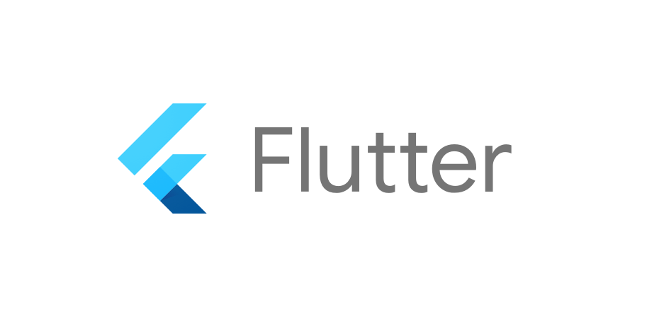

**Document Information:**

|                   | Information |
| ----------------- | ----------- |
| Document Owner    | Mouatassime Seiv|
| Creation Date     | 2024/05/21  |
| Last Update Date  | 2024/06/06  |

 

# Table of Contents

1. [Adopte Un Candidat - Technical Plan Summary](#adopte-un-candidat---technical-plan-summary)
    - [Project Overview](#project-overview)
    - [User Authentication Workflow](#user-authentication-workflow)
        - [Processes](#processes)
        - [Decision Points](#decision-points)
    - [Candidate Information Management Workflow](#candidate-information-management-workflow)
        - [Processes](#processes-1)
    - [Tools and Technologies](#tools-and-technologies)
        - [Figma](#figma)
        - [Flutter](#flutter)
    - [Project Implementation Plan](#project-implementation-plan)
        - [Objectives](#objectives)
        - [Architecture](#architecture)
        - [Phases](#phases)
    - [Team Structure](#team-structure)
    - [Tools Used](#tools-used)
    - [Libraries for Flutter Development](#libraries-for-flutter-development)
    - [Tech Plan Highlights](#tech-plan-highlights)
    - [Diagram](#diagram)
    - [Project Timeline](#project-timeline)
    - [Glossary](#glossary)
2. [Project Scope and Objectives](#project-scope-and-objectives)
    - [Objectives](#objectives-1)
    - [Scope](#scope)
3. [Technology Stack](#technology-stack)
    - [Frontend](#frontend)
    - [Backend](#backend)
    - [Services and Tools](#services-and-tools)
4. [Architecture Design](#architecture-design)
    - [App Structure](#app-structure)
    - [Data Flow](#data-flow)
5. [Implementation Plan](#implementation-plan)
    - [Phase 1: Requirements and Planning](#phase-1-requirements-and-planning)
    - [Phase 2: Project Setup](#phase-2-project-setup)
    - [Phase 3: UI Development](#phase-3-ui-development)
    - [Phase 4: State Management and Local Storage](#phase-4-state-management-and-local-storage)
    - [Phase 5: Integration and Testing](#phase-5-integration-and-testing)
    - [Phase 6: Deployment](#phase-6-deployment)
    - [Phase 7: Post-Launch Support](#phase-7-post-launch-support)
6. [User Authentication Workflow (Detailed)](#user-authentication-workflow-detailed)
    - [Processes](#processes-2)
    - [Decision Points](#decision-points-1)
7. [Candidate Information Management Workflow (Detailed)](#candidate-information-management-workflow-detailed)
    - [Processes](#processes-3)
8. [Detailed Tools and Technologies](#detailed-tools-and-technologies)
    - [Figma](#figma-1)
    - [Flutter](#flutter-1)
9. [Team Structure (Detailed)](#team-structure-detailed)
10. [Tools Used (Detailed)](#tools-used-detailed)
11. [Libraries for Flutter Development (Detailed)](#libraries-for-flutter-development-detailed)
12. [Tech Plan Highlights (Detailed)](#tech-plan-highlights-detailed)
14. [Full Project Timeline](#full-project-timeline)


# Adopte Un Candidat - Technical Plan Summary


## Project Overview
Adopte Un Candidat is a cross-platform mobile recruitment application developed using Flutter. The app focuses on connecting companies with candidates through a "Tinder-style" matching process, emphasizing soft skills. The plan details the processes, technologies, tools, and implementation phases.

## User Authentication Workflow

### Processes
1. **Login**s
   - API: `api/login [POST]`
   - Options: Forgotten password, registration

2. **Registration**
   - API: `api/register [POST]`
   - Username validation: `api/username/:username [GET]`

3. **Password Recovery**
   - API: `api/motdepasse [POST]`

### Decision Points
- Success checks for login, registration, and password recovery actions.

## Candidate Information Management Workflow

### Processes
1. **Home/Menu**
   - Local storage for session management

2. **Company Search List**
   - Search candidates and view profiles
   - API: `api/private/candidate? [GET]`

3. **Candidate Profile View**
   - API: `api/private/profile/:id [GET]`
   - Chat initiation from profile view

4. **Candidate Information**
   - API for fetching and updating: `api/private/profile/:id [GET]`, `api/private/profile/:id [POST]`
   - Document upload: `api/insc_upload [POST]`

5. **Candidate Settings**
   - APIs for updating password, email, profile pictures: `api/private/password/:id [PUT]`, `api/private/email/:id [PUT]`, `api/private/settings [PUT]`

## Tools and Technologies

### Figma
- **Advantages**: Cloud-based, real-time collaboration, cross-platform compatibility.
- **Disadvantages**: Internet-dependent, potential performance issues with large projects.

### Flutter
- **Advantages**: Fast development, rich set of pre-designed widgets, strong performance.
- **Disadvantages**: Large app sizes, limited third-party libraries, native feature support.

## Project Implementation Plan

### Objectives
- Develop a user-friendly, secure recruitment app.
- Implement features for user authentication, profile management, soft skills matching, messaging, and data anonymization.

### Architecture
- **Models**: Data structures for users, profiles, messages, and skills.
- **Services**: Simulated services for authentication, profile management, matching, and messaging.
- **State Management**: Provider, Riverpod, or Bloc.
- **UI Components**: Modular and reusable components.

### Phases
1. **Requirements and Planning**
2. **Project Setup**
3. **UI Development**
4. **State Management and Local Storage**
5. **Integration and Testing**
6. **Deployment**
7. **Post-Launch Support**

# team-structure

| Photo                                                                 | Name                 | Role               | LinkedIn                                                |
| --------------------------------------------------------------------- | -------------------- | ------------------ | ------------------------------------------------------- |
|  | Paul NOWAK           | Project Manager    | [LinkedIn](https://www.linkedin.com/in/paul-nowak-0757a61a7/) |
|  | Vivien Bistrel TSANGUE CHOUNGOU | Program Manager    | [LinkedIn](https://www.linkedin.com/in/bistrel-tsangue-603635261/) |
|  | Mouatassime SEIV     | Technical Leader   | [LinkedIn](https://www.linkedin.com/in/moutassime-seiv-9542171a9/) |
|  | Abderrazaq MAKRAN    | Technical Writer   | [LinkedIn](https://www.linkedin.com/in/abderrazaq-makran/) |
|  | Mathis LEBEL         | Quality Assurance  | [LinkedIn](https://www.linkedin.com/in/mathis-lebel-429114293/) |

## Tools Used
- **Figma**
- **Visual Studio Code**
- **Flutter**
- **Git**

# libraries-for-flutter-development
1. **Flutter SDK**: Core framework.
2. **Provider/Riverpod**: State management.
3. **Dio/http**: Networking.

 # tech-plan-highlights
- **Cross-platform**: One codebase for iOS and Android.
- **Hot reload**: Fast development and testing.
- **Pre-designed widgets**: Extensive and customizable.
- **Local storage**: Hive or SharedPreferences.
- **Mock services**: Simulate backend interactions.

This technical plan ensures a well-structured approach for developing and deploying the Adopte Un Candidat application, focusing on efficient development, user-friendly interfaces, and secure data handling.


# diagram

This is a flowchart that outlines the processes and interactions within a web application, particularly focusing on user authentication, candidate information management, and settings. Here's a step-by-step breakdown:

1 - Password and logins

2 - Candidate details

3 - Company hiring/recruiting process

 ### https://app.creately.com/d/fqCu9nL0a1Z/view ( click on the the link for the Full Diagramm )

### This flowchart details the user authentication process in a web application, including login, registration, and password recovery. Here is a breakdown of each step:


# project-timeline

**Week 1**: Requirements gathering, planning, and design.

**Week 2-3**: Project setup, UI development, and state management.

**Week 4**: Integration and testing.

**Week 5**: Deployment preparation and app store submissions.

**Week 6**: Post-launch support and feature enhancements.


### Start
1. **Start**: This is the initial state of the process.

### Login Process
2. **LOGIN**: The user attempts to log in.
   - If the user has forgotten their password, they can use the **FORGOTTEN PASSWORD** process.
   - If the user needs to create an account, they can go to the **REGISTER** process.

3. **api/login [POST]**: This API call attempts to authenticate the user with their provided credentials.
   - If successful, the user proceeds to the next step (not shown in this flowchart, likely the home page or dashboard).
   - If unsuccessful, the user remains at the login screen and may retry logging in or use other options like password recovery.

### processes-2
4. **REGISTER**: New users can create an account.
   - The system validates the uniqueness of the username via the `api/username/:username [GET]` API call.
   - If the username is unique, the system creates the account using the `api/register [POST]` API call.
   - Upon successful registration, the user receives a success message at the login page and can proceed to log in.

# processes-3

5. **FORGOTTEN PASSWORD**: If the user forgets their password, they can initiate a password recovery process.
   - The user submits a request via the `api/motdepasse [POST]` API call.
   - If successful, the system sends an email with a confirmation message and further instructions to reset the password.

### Decision Points
6. **Success?**: This decision point determines if the previous action (login, registration, or password recovery) was successful.
   - If yes, the user proceeds accordingly (e.g., log in, account creation success message, email sent for password recovery).
   - If no, the user may need to retry or correct their input based on the feedback provided by the system.

### Flow Direction
- **Arrows** indicate the direction of the process flow based on user actions and system responses.
- **Green Diamonds** represent decision points checking the success of actions.
- **Blue Rectangles** represent user actions or system states (LOGIN, REGISTER, FORGOTTEN PASSWORD).
- **Red Rectangles** represent API calls that handle the actual processing (login, register, validate username, and password recovery).

Overall, this flowchart provides a clear map of the user authentication workflow, including the necessary steps for logging in, registering, and recovering a forgotten password, along with the relevant API interactions.


# Candidate-information-management-workflow-detailed

## Second part 

This flowchart illustrates the user journey within an application focusing on candidate information management, settings, and related API interactions. Here's a detailed breakdown of the processes:


### Home/Menu
1. **HOME / MENU**: After logging in, users reach the home/menu screen.
   - User information is stored locally to manage the session and preferences.

### Company Search List
2. **COMPANY SEARCH LIST < LIST VIEW >**: Users can search for candidates using a list view.
   - Users initiate a search which can retrieve a global list of candidates.
   - They can select a candidate to view more details.

### Candidate Profile View
3. **Select candidate**: After selecting a candidate, an API call `api/private/candidate? [GET]` retrieves the candidate's profile information.
4. **CANDIDATE PROFILE VIEW**: Detailed view of the selected candidate's profile.
   - Users can get additional information about the candidate.
   - Users can initiate a chat from this view if needed.

### Candidate Information
5. **Candidate INFORMATION**: Users can view and update their own candidate information.
   - The system fetches candidate information using the API `api/private/profile/:id [GET]`.
   - Users can update their information through the API `api/private/profile/:id [POST]`.
   - Users can also upload additional documents or information using the API `api/insc_upload [POST]`.

### Candidate Settings
6. **Candidate SETTINGS**: Users manage their personal settings, such as password, email, and profile pictures.
   - **Edit password**: Uses the API `api/private/password/:id [PUT]`.
   - **Update email**: Uses the API `api/private/email/:id [PUT]`.
   - **Upload new pictures**: Users can upload new profile pictures using the API `api/private/settings [PUT]`.
     - For setting the main profile picture, `api/private/main_picture/:id [PUT]` is used.
     - For uploading to the gallery, `api/private/gallery_upload [POST]` is used.
     - For deleting pictures, `api/private/gallery_upload/:id [DELETE]` is used.

### Data Flow and Interaction
- **Local Storage**: Stores user information for session management and quick access.
- **API Calls**: Various endpoints handle the retrieval and updating of candidate information and settings.
- **Arrows**: Indicate the flow of actions and data between the components and processes.
- **Green Diamonds**: Decision points checking the success of an action before proceeding to the next step.
- **Blue Rectangles**: Represent user actions or system states (e.g., HOME / MENU, COMPANY SEARCH LIST, Candidate INFORMATION, Candidate SETTINGS).
- **Red Rectangles**: Represent API interactions for data retrieval and updates.

### Overall Flow
1. Users start at the **HOME / MENU**.
2. They can search for candidates and view their profiles.
3. They can update their own candidate information.
4. They can manage their settings, including updating their password, email, and profile pictures.

This flowchart provides a comprehensive view of the interactions within the application, focusing on candidate management and user settings, detailing the API calls involved and how user data is handled and stored.


# detailed-tools-and-technologies:

# figma-1
### 
                             FIGMA :

Figma is a graphics editing and prototyping program . Figma is mainly used for digital design: in other words, for the design of websites and application interfaces.


| **Advantages**                                                | **Inconveniences**                                     |
|---------------------------------------------------------------|--------------------------------------------------------|
| **Cloud-based platform**                                      | **Dependent on internet connection**                   |
| Accessible from anywhere with an internet connection         | Requires a stable internet connection to function      |
| **Real-time collaboration**                                   | **Performance issues on large projects**               |
| Multiple users can work on the same file simultaneously       | Can become slow or laggy with very large files         |
| **Cross-platform compatibility**                              | **Limited offline capabilities**                       |
| Works on Windows, macOS, Linux, and web browsers              | Limited functionality when not connected to the internet|
| **Design and prototyping in one tool**                        | **Subscription cost for premium features**             |
| Allows both designing and prototyping without switching tools | Free version has limitations, premium plans can be expensive |
| **Intuitive and user-friendly interface**                     | **Steeper learning curve for advanced features**       |
| Easy to learn for beginners, with a clean and organized UI    | Advanced features and plugins require more time to master |
| **Component and style management**                            | **Plugin ecosystem still growing**                     |
| Efficient reuse of components and consistent styling          | Although growing, the number of plugins is still limited |
| **Version control and history**                               | **Browser dependency**                                 |
| Maintains a history of changes, allowing easy reversion       | Performance and experience can vary across different browsers |
| **Strong community and resource support**                     | **File management complexity**                         |
| Large community with extensive tutorials and resources        | Managing multiple projects and files can become cumbersome |
| **Integrations with other tools**                             | **Limited animation capabilities**                     |
| Integrates well with tools like Slack, Zeplin, and more       | Basic animation features compared to dedicated tools like After Effects |
| **Scalable for teams and enterprises**                        | **Data privacy concerns**                              |
| Suitable for both small teams and large organizations         | Storing sensitive design data on a third-party server can be a concern |
| **Frequent updates and new features**                         | **Complexity in handling design systems**              |
| Regularly updated with new features and improvements          | Managing and updating large design systems can be challenging |

# flutter-1
### 

                            Flutter: 
Flutter uses the programming language Dart and compiles into machine code. Host devices understand this code, which ensures a fast and effective performance.* 




| **Advantages**                                                | **Inconveniences**                                   |
|---------------------------------------------------------------|------------------------------------------------------|
| **Cross-platform development**                                | **Large app sizes**                                  |
| Write one codebase for iOS, Android, web, and desktop         | Flutter apps tend to have larger file sizes          |
| **Fast development**                                          | **Limited third-party libraries**                    |
| Hot reload feature allows for quick code changes and testing | Although growing, Flutter's ecosystem is smaller     |
| **High performance**                                          | **Limited support for certain native features**      |
| Compiled to native ARM code for fast execution               | Some platform-specific features may not be supported |
| **Rich set of pre-designed widgets**                         | **Learning curve for Dart language**                 |
| Provides extensive widgets that are customizable             | Developers need to learn Dart, which is less common  |
| **Consistent UI across platforms**                            | **Performance can vary on different platforms**      |
| Ensures uniform look and feel on different OS                 | Optimization needed for each platform individually   |
| **Strong community and corporate support**                   | **More resource-intensive**                          |
| Backed by Google and has an active developer community       | Can consume more CPU and memory compared to native   |
| **Open-source and free**                                     | **Fewer UI templates compared to native SDKs**       |
| Free to use with a wealth of community-contributed packages  | Limited in-built UI templates, requiring custom designs |
| **Customizable and flexible UI**                             | **Some platform-specific look and feel issues**      |
| Enables highly tailored and dynamic UIs                      | May not perfectly match the native appearance        |
| **Access to native features through plugins**                | **Still maturing and evolving framework**            |
| Large repository of plugins for native functionalities       | Rapid changes can introduce instability              |
| **Strong documentation and resources**                       | **Potential for changes and deprecations**           |
| Comprehensive official documentation and tutorials available | Features may be deprecated as the framework evolves  |


### Tech Plan for Adopte Un Candidat Using Flutter (Frontend Only)

# Project Scope and Objectives
# objectives-1:
- Develop a cross-platform mobile recruitment application using Flutter.
- Implement a "Tinder-style" matching process focusing on soft skills.
- Ensure the anonymization of candidates and companies.
- Provide features for messaging, profile management, and secure data handling.

# scope:
- User Authentication (Registration, Login, Password Recovery)
- Candidate and Company Profile Management
- Soft Skills Selection and Matching Algorithm
- Messaging System
- Anonymization and Data Security
- Multi-platform Accessibility (iOS and Android)

# technology-stack
# Frontend:
- **Mobile App**: Flutter

# Backend:
- **Not Included**: Mock data and local storage will simulate backend functionality.

# services-and-tools:
- **Local Storage**: Hive or SharedPreferences for persistent local storage.
- **State Management**: Provider, Riverpod, or Bloc.
- **Network Requests**: Dio or http package (for future backend integration).
- **Authentication**: Firebase Authentication (for future backend integration).
- **Push Notifications**: Firebase Cloud Messaging (FCM) for notifications.
- **UI Design**: Figma and Flutter for UI/UX design and prototyping.

3. # architecture-design
# App Structure :
- **Models**: Data structures for users, profiles, messages, and skills.
- **Services**: Simulated services for authentication, profile management, matching, and messaging.
- **State Management**: Provider, Riverpod, or Bloc to manage application state.
- **UI Components**: Modular and reusable components for different parts of the app.

# Data Flow:
1. **Local Storage**: Store user data, profiles, and messages locally.
2. **State Management**: Manage the application state using a chosen state management solution.
3. **Mock Services**: Simulate backend responses and interactions.
4. **UI Components**: Render data and handle user interactions.

# Implementation-plan
# Phase 1: Requirements and Planning
- Define detailed requirements and use cases.
- Create technical specifications and user stories.
- Design UI/UX mockups using Figma.

# Phase 2: Project Setup
- Set up the Flutter project structure.
- Install necessary packages (Provider, Riverpod, Bloc, Dio, etc.).

# Phase 3: UI Development
- Implement authentication screens (login, registration, password recovery).
- Develop user profile management and soft skills selection UI.
- Create the matching interface inspired by Tinder's swipe functionality.
- Implement messaging functionality.

# Phase 4: State Management and Local Storage
- Set up state management using Provider, Riverpod, or Bloc.
- Implement local storage using Hive or SharedPreferences.
- Simulate backend services for authentication, profile management, matching, and messaging.

# Phase 5: Integration and Testing
- Integrate UI components with state management and local storage.
- Perform unit and integration testing for each module.
- Conduct user acceptance testing (UAT) to ensure all functionalities meet requirements.

# Phase 6: Deployment
- Prepare the app for deployment on Google Play Store and Apple App Store.
- Set up Firebase Cloud Messaging for push notifications.
- Configure app permissions and settings for both iOS and Android.

# Phase 7: Post-Launch Support
- Monitor application performance and error logs.
- Collect user feedback and iterate on features.
- Implement additional features based on user needs and market trends.

**This tech plan outlines the development, testing, and deployment strategy for the Adopte Un Candidat project using Flutter. The focus is on creating a user-friendly and secure recruitment application, with UI/UX designs and prototypes created using Figma.**


# tools-used-detailed

<div style="display: flex; flex-wrap: wrap; align-items: center; gap: 20px;">

  <div style="text-align: center;">
    
  </div>
  <div style="text-align: center;">
    
  </div>
  <div style="text-align: center;">
    
  </div>
  <div style="text-align: center;">
    
  
  </div>
  <div style="text-align: center;">
    
  </div>   
  </div>
</div>


### To develop a mobile app in Flutter that connects companies with employees in a manner similar to Tinder, you will need a combination of libraries to handle various functionalities like UI, state management, backend services, real-time communication, and more. Here’s a comprehensive list of the main libraries you should use:


### Core Libraries
1. **Flutter SDK**: The core framework for building the app.

### State Management
2. **Provider** or **Riverpod**: These are the most popular state management solutions in Flutter. They help manage the state of your application efficiently.

### Networking and Backend
3. **Dio** or **http**: For making HTTP requests to your backend API.
4. **Firebase**: For backend services including authentication, real-time database, cloud storage, and more.
   - **firebase_core**
   - **firebase_auth**
   - **cloud_firestore**
   - **firebase_storage** (for handling image uploads)

### UI Components
5. **Flutter Tinder Cards (flutter_tindercard)**: For creating the swipeable card interface similar to Tinder.
6. **Image Picker**: For handling image uploads from the user's device.
7. **Flutter Form Builder**: For building and validating forms.

### Real-time Communication
8. **Socket.io Client**: For enabling real-time chat functionality.

### Notifications and Animations
9. **Flutter Local Notifications**: For handling in-app notifications.
10. **Animations Package**: For creating smooth and responsive animations.

### Location Services (if needed)
11. **Geolocator**: For handling location-based services.
12. **Google Maps Flutter**: For integrating maps and location-based features.

### Example Setup
Here’s how you can include these dependencies in your `pubspec.yaml` file:

```yaml
dependencies:
  flutter:
    sdk: flutter
  provider: ^6.0.0
  dio: ^5.0.0
  firebase_core: ^2.5.0
  firebase_auth: ^4.5.0
  cloud_firestore: ^4.5.0
  firebase_storage: ^12.5.0
  google_maps_flutter: ^3.5.0
  geolocator: ^9.0.0
  flutter_tindercard: ^0.3.0
  image_picker: ^1.0.0
  socket_io_client: ^2.0.0
  flutter_local_notifications: ^12.5.0
  animations: ^4.5.0
  flutter_form_builder: ^7.5.0
```

### Basic Workflow

1. **Setup Firebase**: Initialize Firebase in your Flutter project for authentication, real-time database, and storage.
2. **State Management**: Use Provider or Riverpod to manage the state of your application.
3. **Create Swipeable Cards**: Implement swipeable cards using `flutter_tindercard` for company and employee profiles.
4. **Networking**: Use Dio or http to handle API requests to your backend services.
5. **Real-time Communication**: Implement Socket.io for real-time chat and updates between companies and employees.
6. **Form Handling**: Use Flutter Form Builder to create and validate forms for user profiles, job applications, etc.
7. **Image Uploads**: Use Image Picker and Firebase Storage to handle profile image uploads.
8. **Location Services**: Integrate Geolocator and Google Maps Flutter if your app requires location-based features.
9. **Notifications**: Use Flutter Local Notifications to send notifications to users about new matches, messages, etc.
10. **Animations**: Use the Animations package to enhance the user experience with smooth transitions and animations.

### Sample Implementation

Here’s a brief example of how you might implement some of these functionalities:

**Initialize Firebase in `main.dart`**:

```dart
void main() async {
  WidgetsFlutterBinding.ensureInitialized();
  await Firebase.initializeApp();
  runApp(MyApp());
}
```

**State Management with Provider**:

```dart
class MyApp extends StatelessWidget {
  @override
  Widget build(BuildContext context) {
    return MultiProvider(
      providers: [
        ChangeNotifierProvider(create: (_) => AuthService()),
        ChangeNotifierProvider(create: (_) => UserProfileService()),
      ],
      child: MaterialApp(
        home: HomeScreen(),
      ),
    );
  }
}
```

**Creating Swipeable Cards**:

```dart
import 'package:flutter_tindercard/flutter_tindercard.dart';

class SwipeScreen extends StatelessWidget {
  @override
  Widget build(BuildContext context) {
    CardController controller;
    return Scaffold(
      body: TinderSwapCard(
        orientation: AmassOrientation.BOTTOM,
        totalNum: 6,
        stackNum: 3,
        swipeEdge: 4.0,
        maxWidth: MediaQuery.of(context).size.width * 0.9,
        maxHeight: MediaQuery.of(context).size.width * 1.2,
        minWidth: MediaQuery.of(context).size.width * 0.8,
        minHeight: MediaQuery.of(context).size.width * 1.1,
        cardBuilder: (context, index) => Card(
          child: Image.network(dummyProfileImages[index]),
        ),
        cardController: controller = CardController(),
      ),
    );
  }
}
```

By following these steps and using these libraries, you can create a robust and feature-rich mobile app in Flutter that connects companies with employees in a manner similar to Tinder.


#### Glossary

| Term                          | Definition                                                                                       |
|-------------------------------|--------------------------------------------------------------------------------------------------|
| **API (Application Programming Interface)** | A set of rules and definitions that allow software applications to communicate with each other. |
| **Bloc**                      | A state management library for Flutter that helps manage complex state and business logic.        |
| **Dio**                       | A powerful HTTP client for Dart, used in Flutter applications for making network requests.        |
| **Figma**                     | A cloud-based design tool used for creating user interfaces and collaborating in real time.       |
| **Firebase Authentication**   | A service that provides backend services for easy and secure user authentication.                 |
| **Flutter**                   | An open-source UI software development toolkit created by Google for building natively compiled applications for mobile, web, and desktop from a single codebase. |
| **Hive**                      | A lightweight and fast key-value database written in pure Dart for Flutter applications.          |
| **Provider**                  | A state management library for Flutter used to handle and manage application state efficiently.   |
| **Riverpod**                  | An improved version of the Provider state management library offering a more robust and flexible way to manage state in Flutter applications. |
| **SharedPreferences**         | A Flutter plugin that provides a way to store simple data in the form of key-value pairs locally. |
| **UI (User Interface)**       | The means by which a user interacts with a computer, software, or application, often focusing on the look and feel. |
| **UX (User Experience)**      | The overall experience a user has when interacting with a product or system, emphasizing ease of use and efficiency. |

 
# UML Diagram for ADOPTE CANDIDATE App

## Class Diagram Components

### User

| Attribute      | Type   | Description                     |
|----------------|--------|---------------------------------|
| `userId`       | String | Unique identifier               |
| `email`        | String | Email address                   |
| `password`     | String | User password                   |
| `userType`     | String | Type of user (employee/company) |

| Method         | Description                          |
|----------------|--------------------------------------|
| `login()`      | Log in the user                      |
| `logout()`     | Log out the user                     |
| `register()`   | Register a new user                  |
| `updateProfile()` | Update user's profile information |

### EmployeeProfile (inherits from User)

| Attribute      | Type   | Description              |
|----------------|--------|--------------------------|
| `employeeId`   | String | Employee identifier      |
| `name`         | String | Employee name            |
| `resume`       | String | Link to resume           |
| `skills`       | String | List of skills           |
| `experience`   | String | Work experience          |
| `education`    | String | Educational background   |
| `location`     | String | Location of the employee |

| Method             | Description                               |
|--------------------|-------------------------------------------|
| `uploadResume()`   | Upload a new resume                       |
| `editProfile()`    | Edit employee profile                     |
| `viewCompanyProfile()` | View company profiles                 |

### CompanyProfile (inherits from User)

| Attribute      | Type   | Description             |
|----------------|--------|-------------------------|
| `companyId`    | String | Company identifier      |
| `companyName`  | String | Name of the company     |
| `description`  | String | Company description     |
| `industry`     | String | Industry of the company |
| `location`     | String | Location of the company |
| `jobPostings`  | List   | List of job postings    |

| Method               | Description                              |
|----------------------|------------------------------------------|
| `createJobPosting()` | Create a new job posting                 |
| `editJobPosting()`   | Edit an existing job posting             |
| `viewEmployeeProfile()` | View employee profiles                |

### JobPosting

| Attribute      | Type   | Description              |
|----------------|--------|------------------------- |
| `jobId`        | String | Job identifier           |
| `companyId`    | String | Identifier of the company|
| `title`        | String | Job title                |
| `description`  | String | Job description          |
| `requirements` | String | Job requirements         |
| `location`     | String | Job location             |
| `salary`       | String | Job salary               |

| Method          | Description                              |
|-----------------|------------------------------------------|
| `createJob()`   | Create a new job                         |
| `editJob()`     | Edit an existing job                     |
| `closeJob()`    | Close a job posting                      |

### Match

| Attribute      | Type   | Description             |
|----------------|--------|-------------------------|
| `matchId`      | String | Match identifier        |
| `employeeId`   | String | Identifier of the employee|
| `jobId`        | String | Identifier of the job   |
| `status`       | String | Status of the match (pending, accepted, rejected) |

| Method            | Description                              |
|-------------------|------------------------------------------|
| `createMatch()`   | Create a new match                       |
| `updateStatus()`  | Update the status of a match             |

### Application

| Attribute      | Type   | Description             |
|----------------|--------|-------------------------|
| `applicationId`| String | Application identifier  |
| `employeeId`   | String | Identifier of the employee|
| `jobId`        | String | Identifier of the job   |
| `status`       | String | Status of the application (applied, reviewed, interviewed, hired, rejected) |

| Method                   | Description                              |
|--------------------------|------------------------------------------|
| `applyForJob()`          | Apply for a job                          |
| `updateApplicationStatus()` | Update the status of an application   |

### Message

| Attribute      | Type   | Description               |
|----------------|--------|-------------------------  |
| `messageId`    | String | Message identifier        |
| `senderId`     | String | Identifier of the sender  |
| `receiverId`   | String | Identifier of the receiver|
| `matchId`      | String | Identifier of the match   |
| `content`      | String | Message content           |
| `timestamp`    | String | Timestamp of the message  |

| Method            | Description                              |
|-------------------|------------------------------------------|
| `sendMessage()`   | Send a message                           |
| `viewMessageThread()` | View the message thread              |

---


## 2 ##

# UML Diagram for Recruitment App

## diagram-detailed

```plaintext
+----------------+              +-----------------+               +-------------------+
|     User       |<|---------|  | EmployeeProfile |               |  CompanyProfile   |
|----------------|              |-----------------|               |-------------------|
| - userId       |              | - employeeId    |               | - companyId       |
| - email        |              | - name          |               | - companyName     |
| - password     |              | - resume        |               | - description     |
| - userType     |              | - skills        |               | - industry        |
|----------------|              | - experience    |               | - location        |
| + login()      |              | - education     |               | - jobPostings     |
| + logout()     |              | - location      |               |-------------------|
| + register()   |              |-----------------|               | + createJobPosting()|
| + updateProfile()|            | + uploadResume()|               | + editJobPosting() |
+----------------+              | + editProfile() |               | + viewEmployeeProfile() |
                                | + viewCompanyProfile()|         +-------------------+
                                +-----------------+
                                      ^                                    ^
                                      |                                    |
                                      |                                    |
                                      |                                    |
                           +-----------+---------------+     +-------------+---------------+
                           |       JobPosting          |     |             Match           |
                           |---------------------------|     |-----------------------------|
                           | - jobId                   |     | - matchId                   |
                           | - companyId               |     | - employeeId                |
                           | - title                   |     | - jobId                     |
                           | - description             |     | - status                    |
                           | - requirements            |     |-----------------------------|
                           | - location                |     | + createMatch()             |
                           | - salary                  |     | + updateStatus()            |
                           |---------------------------|     +-----------------------------+
                           | + createJob()             |
                           | + editJob()               |                 |
                           | + closeJob()              |                 |
                           +---------------------------+                 |
                                      ^                                  |
                                      |                                  |
                                      |                                  |
                                      |                                  |
                              +-------+--------+                         |
                              |    Application   |                       |
                              |----------------- |                       |
                              | - applicationId  |                       |
                              | - employeeId     |                       |
                              | - jobId          |                       |
                              | - status         |                       |
                              |------------------|                       |
                              | + applyForJob()  |                       |
                              | + updateApplicationStatus()|             |
                              +------------------+                       |
                                                                         |
                                                                         |
                                                                    +----+--------+
                                                                    |   Message    |
                                                                    |--------------|
                                                                    | - messageId  |
                                                                    | - senderId   |
                                                                    | - receiverId |
                                                                    | - matchId    |
                                                                    | - content    |
                                                                    | - timestamp  |
                                                                    |--------------|
                                                                    | + sendMessage()|
                                                                    | + viewMessageThread()|
                                                                    +----------------+