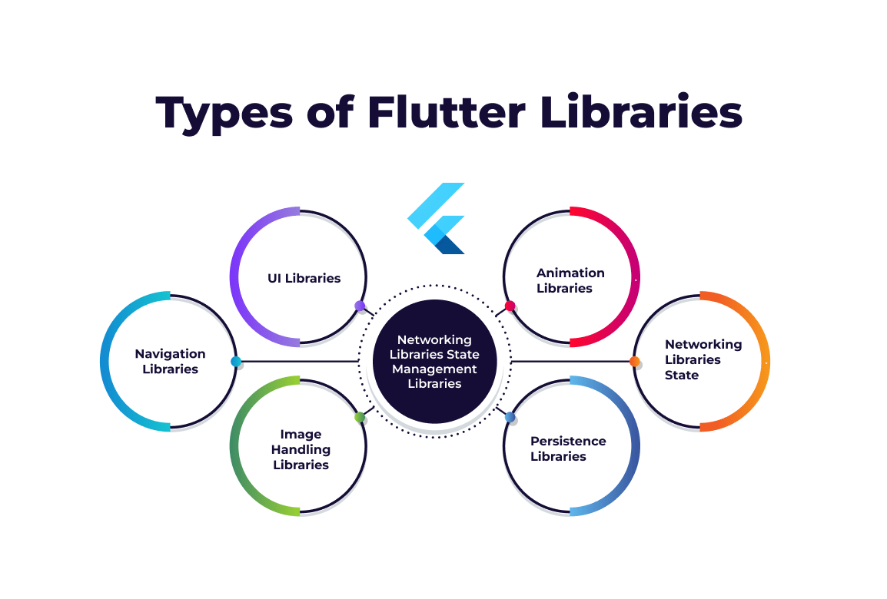

**Document Information:**

|                   | Information |
| ----------------- | ----------- |
| Document Owner    | Mouatassime Seiv|
| Creation Date     | 2024/05/21  |
| Last Update Date  | 2024/05/23 |

### Tools and Software used

<div style="display: flex; flex-wrap: wrap; align-items: center; gap: 20px;">

  <div style="text-align: center;">
    
  </div>
  <div style="text-align: center;">
    
  </div>
  <div style="text-align: center;">
    
  </div>
  <div style="text-align: center;">
    
  
  </div>
  <div style="text-align: center;">
    
  </div>   
  </div>
</div>


To develop a mobile app in Flutter that connects companies with employees in a manner similar to Tinder, you will need a combination of libraries to handle various functionalities like UI, state management, backend services, real-time communication, and more. Here’s a comprehensive list of the main libraries you should use:



### Core Libraries
1. **Flutter SDK**: The core framework for building the app.

### State Management
2. **Provider** or **Riverpod**: These are the most popular state management solutions in Flutter. They help manage the state of your application efficiently.

### Networking and Backend
3. **Dio** or **http**: For making HTTP requests to your backend API.
4. **Firebase**: For backend services including authentication, real-time database, cloud storage, and more.
   - **firebase_core**
   - **firebase_auth**
   - **cloud_firestore**
   - **firebase_storage** (for handling image uploads)

### UI Components
5. **Flutter Tinder Cards (flutter_tindercard)**: For creating the swipeable card interface similar to Tinder.
6. **Image Picker**: For handling image uploads from the user's device.
7. **Flutter Form Builder**: For building and validating forms.

### Real-time Communication
8. **Socket.io Client**: For enabling real-time chat functionality.

### Notifications and Animations
9. **Flutter Local Notifications**: For handling in-app notifications.
10. **Animations Package**: For creating smooth and responsive animations.

### Location Services (if needed)
11. **Geolocator**: For handling location-based services.
12. **Google Maps Flutter**: For integrating maps and location-based features.

### Example Setup
Here’s how you can include these dependencies in your `pubspec.yaml` file:

```yaml
dependencies:
  flutter:
    sdk: flutter
  provider: ^6.0.0
  dio: ^5.0.0
  firebase_core: ^2.5.0
  firebase_auth: ^4.5.0
  cloud_firestore: ^4.5.0
  firebase_storage: ^12.5.0
  google_maps_flutter: ^3.5.0
  geolocator: ^9.0.0
  flutter_tindercard: ^0.3.0
  image_picker: ^1.0.0
  socket_io_client: ^2.0.0
  flutter_local_notifications: ^12.5.0
  animations: ^4.5.0
  flutter_form_builder: ^7.5.0
```

### Basic Workflow

1. **Setup Firebase**: Initialize Firebase in your Flutter project for authentication, real-time database, and storage.
2. **State Management**: Use Provider or Riverpod to manage the state of your application.
3. **Create Swipeable Cards**: Implement swipeable cards using `flutter_tindercard` for company and employee profiles.
4. **Networking**: Use Dio or http to handle API requests to your backend services.
5. **Real-time Communication**: Implement Socket.io for real-time chat and updates between companies and employees.
6. **Form Handling**: Use Flutter Form Builder to create and validate forms for user profiles, job applications, etc.
7. **Image Uploads**: Use Image Picker and Firebase Storage to handle profile image uploads.
8. **Location Services**: Integrate Geolocator and Google Maps Flutter if your app requires location-based features.
9. **Notifications**: Use Flutter Local Notifications to send notifications to users about new matches, messages, etc.
10. **Animations**: Use the Animations package to enhance the user experience with smooth transitions and animations.

### Sample Implementation

Here’s a brief example of how you might implement some of these functionalities:

**Initialize Firebase in `main.dart`**:

```dart
void main() async {
  WidgetsFlutterBinding.ensureInitialized();
  await Firebase.initializeApp();
  runApp(MyApp());
}
```

**State Management with Provider**:

```dart
class MyApp extends StatelessWidget {
  @override
  Widget build(BuildContext context) {
    return MultiProvider(
      providers: [
        ChangeNotifierProvider(create: (_) => AuthService()),
        ChangeNotifierProvider(create: (_) => UserProfileService()),
      ],
      child: MaterialApp(
        home: HomeScreen(),
      ),
    );
  }
}
```

**Creating Swipeable Cards**:

```dart
import 'package:flutter_tindercard/flutter_tindercard.dart';

class SwipeScreen extends StatelessWidget {
  @override
  Widget build(BuildContext context) {
    CardController controller;
    return Scaffold(
      body: TinderSwapCard(
        orientation: AmassOrientation.BOTTOM,
        totalNum: 6,
        stackNum: 3,
        swipeEdge: 4.0,
        maxWidth: MediaQuery.of(context).size.width * 0.9,
        maxHeight: MediaQuery.of(context).size.width * 1.2,
        minWidth: MediaQuery.of(context).size.width * 0.8,
        minHeight: MediaQuery.of(context).size.width * 1.1,
        cardBuilder: (context, index) => Card(
          child: Image.network(dummyProfileImages[index]),
        ),
        cardController: controller = CardController(),
      ),
    );
  }
}
```

By following these steps and using these libraries, you can create a robust and feature-rich mobile app in Flutter that connects companies with employees in a manner similar to Tinder.
