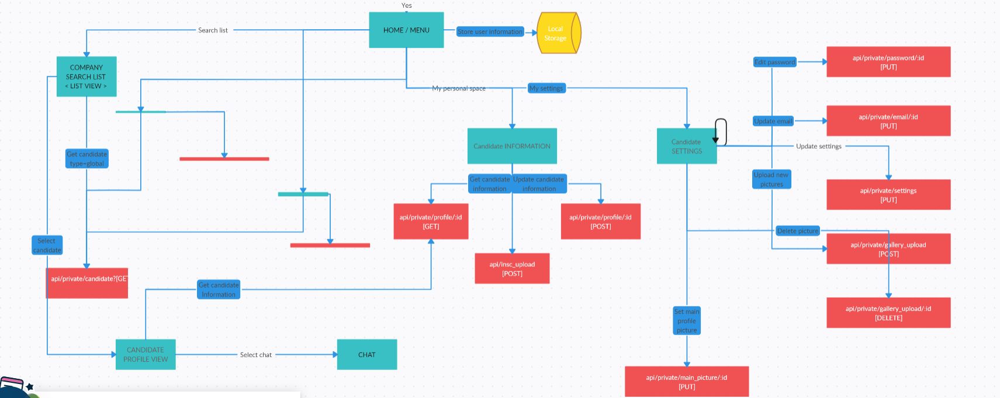

**Document Information:**

|                   | Information |
| ----------------- | ----------- |
| Document Owner    | Mouatassime Seiv|
| Creation Date     | 2024/05/13  |
| Last Update Date  | 2024/05/22  |

### This diagram is a flowchart that outlines the processes and interactions within a web application, particularly focusing on user authentication, candidate information management, and settings. Here's a step-by-step breakdown:

1 - Password and logins

2 - Candidate details

3 - Company hiring/recruiting process

 ### https://app.creately.com/d/fqCu9nL0a1Z/view ( click on the the link for the Full Diagramm )

### This flowchart details the user authentication process in a web application, including login, registration, and password recovery. Here is a breakdown of each step:

### Start
1. **Start**: This is the initial state of the process.

### Login Process
2. **LOGIN**: The user attempts to log in.
   - If the user has forgotten their password, they can use the **FORGOTTEN PASSWORD** process.
   - If the user needs to create an account, they can go to the **REGISTER** process.

3. **api/login [POST]**: This API call attempts to authenticate the user with their provided credentials.
   - If successful, the user proceeds to the next step (not shown in this flowchart, likely the home page or dashboard).
   - If unsuccessful, the user remains at the login screen and may retry logging in or use other options like password recovery.

### Registration Process
4. **REGISTER**: New users can create an account.
   - The system validates the uniqueness of the username via the `api/username/:username [GET]` API call.
   - If the username is unique, the system creates the account using the `api/register [POST]` API call.
   - Upon successful registration, the user receives a success message at the login page and can proceed to log in.

### Forgotten Password Process
5. **FORGOTTEN PASSWORD**: If the user forgets their password, they can initiate a password recovery process.
   - The user submits a request via the `api/motdepasse [POST]` API call.
   - If successful, the system sends an email with a confirmation message and further instructions to reset the password.

### Decision Points
6. **Success?**: This decision point determines if the previous action (login, registration, or password recovery) was successful.
   - If yes, the user proceeds accordingly (e.g., log in, account creation success message, email sent for password recovery).
   - If no, the user may need to retry or correct their input based on the feedback provided by the system.

### Flow Direction
- **Arrows** indicate the direction of the process flow based on user actions and system responses.
- **Green Diamonds** represent decision points checking the success of actions.
- **Blue Rectangles** represent user actions or system states (LOGIN, REGISTER, FORGOTTEN PASSWORD).
- **Red Rectangles** represent API calls that handle the actual processing (login, register, validate username, and password recovery).

Overall, this flowchart provides a clear map of the user authentication workflow, including the necessary steps for logging in, registering, and recovering a forgotten password, along with the relevant API interactions.

## Second part 

This flowchart illustrates the user journey within an application focusing on candidate information management, settings, and related API interactions. Here's a detailed breakdown of the processes:

### Home/Menu
1. **HOME / MENU**: After logging in, users reach the home/menu screen.
   - User information is stored locally to manage the session and preferences.

### Company Search List
2. **COMPANY SEARCH LIST < LIST VIEW >**: Users can search for candidates using a list view.
   - Users initiate a search which can retrieve a global list of candidates.
   - They can select a candidate to view more details.

### Candidate Profile View
3. **Select candidate**: After selecting a candidate, an API call `api/private/candidate? [GET]` retrieves the candidate's profile information.
4. **CANDIDATE PROFILE VIEW**: Detailed view of the selected candidate's profile.
   - Users can get additional information about the candidate.
   - Users can initiate a chat from this view if needed.

### Candidate Information
5. **Candidate INFORMATION**: Users can view and update their own candidate information.
   - The system fetches candidate information using the API `api/private/profile/:id [GET]`.
   - Users can update their information through the API `api/private/profile/:id [POST]`.
   - Users can also upload additional documents or information using the API `api/insc_upload [POST]`.

### Candidate Settings
6. **Candidate SETTINGS**: Users manage their personal settings, such as password, email, and profile pictures.
   - **Edit password**: Uses the API `api/private/password/:id [PUT]`.
   - **Update email**: Uses the API `api/private/email/:id [PUT]`.
   - **Upload new pictures**: Users can upload new profile pictures using the API `api/private/settings [PUT]`.
     - For setting the main profile picture, `api/private/main_picture/:id [PUT]` is used.
     - For uploading to the gallery, `api/private/gallery_upload [POST]` is used.
     - For deleting pictures, `api/private/gallery_upload/:id [DELETE]` is used.

### Data Flow and Interaction
- **Local Storage**: Stores user information for session management and quick access.
- **API Calls**: Various endpoints handle the retrieval and updating of candidate information and settings.
- **Arrows**: Indicate the flow of actions and data between the components and processes.
- **Green Diamonds**: Decision points checking the success of an action before proceeding to the next step.
- **Blue Rectangles**: Represent user actions or system states (e.g., HOME / MENU, COMPANY SEARCH LIST, Candidate INFORMATION, Candidate SETTINGS).
- **Red Rectangles**: Represent API interactions for data retrieval and updates.

### Overall Flow
1. Users start at the **HOME / MENU**.
2. They can search for candidates and view their profiles.
3. They can update their own candidate information.
4. They can manage their settings, including updating their password, email, and profile pictures.

This flowchart provides a comprehensive view of the interactions within the application, focusing on candidate management and user settings, detailing the API calls involved and how user data is handled and stored.
