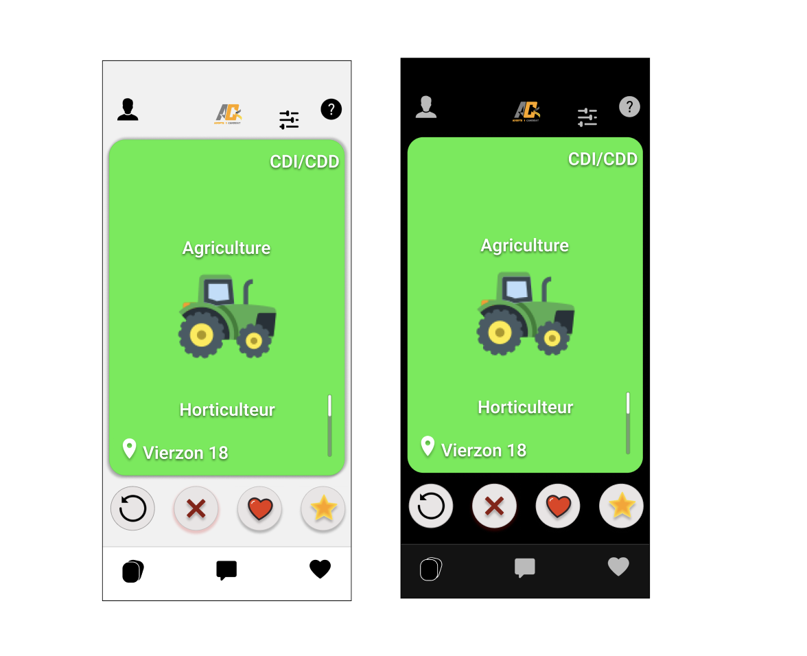
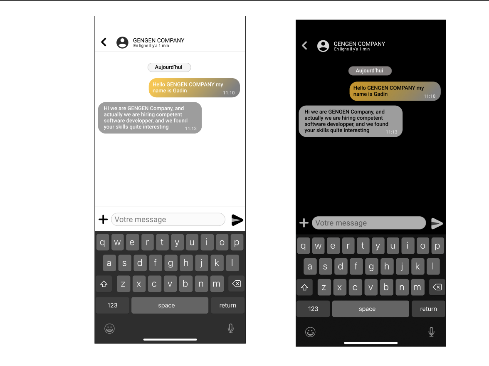

# 2023-2024 - PROJECT-5 - FLUTTER - TEAM - 5
<h1 align="center">
 Functional Specifications
</h1>

created : 18/05/2024 last modified : 24/05/2024

Table of Content

- [2023-2024 - PROJECT-5 - FLUTTER - TEAM - 5](#2023-2024---project-5---flutter---team---5)
- [1. **Introduction**](#1-introduction)
  - [1.1 Project Overview](#11-project-overview)
  - [1.2 Objectives](#12-objectives)
  - [1.3 Stakeholders](#13-stakeholders)
  - [1.4 Scope](#14-scope)
  - [1.5 Deliverables](#15-deliverables)
- [2. **Functional Requirements**](#2-functional-requirements)
  - [2.1 User Profiles](#21-user-profiles)
  - [2.2 Candidate Module](#22-candidate-module)
    - [1. Registration and Login](#1-registration-and-login)
    - [2. Profile Creation and Management](#2-profile-creation-and-management)
    - [3. Job Search and Matching](#3-job-search-and-matching)
    - [4. Application Management](#4-application-management)
    - [5. Notifications and Alerts](#5-notifications-and-alerts)
    - [6. Privacy and Security Settings](#6-privacy-and-security-settings)
    - [Example Content for the Candidate Module](#example-content-for-the-candidate-module)
      - [1. Registration and Login](#1-registration-and-login-1)
      - [2. Profile Creation and Management](#2-profile-creation-and-management-1)
  - [2.3 Employer Module](#23-employer-module)
    - [1. Registration and Login](#1-registration-and-login-2)
    - [2. Company Profile Creation and Management](#2-company-profile-creation-and-management)
    - [3. Job Posting Management](#3-job-posting-management)
    - [4. Candidate Search and Matching](#4-candidate-search-and-matching)
    - [5. Application Management](#5-application-management)
    - [6. Notifications and Alerts](#6-notifications-and-alerts)
    - [7. Privacy and Security Settings](#7-privacy-and-security-settings)
    - [Example Content for the Employer Module](#example-content-for-the-employer-module)
      - [1. Registration and Login](#1-registration-and-login-3)
      - [2. Company Profile Creation and Management](#2-company-profile-creation-and-management-1)
      - [3. Job Posting Management](#3-job-posting-management-1)
      - [4. Candidate Search and Matching](#4-candidate-search-and-matching-1)
      - [5. Application Management](#5-application-management-1)
  - [2.4 Matching Algorithm](#24-matching-algorithm)
    - [2.4.1 Overview](#241-overview)
    - [2.4.2 Algorithm Design](#242-algorithm-design)
    - [2.4.3 Algorithm Workflow](#243-algorithm-workflow)
      - [Technology and Techniques](#technology-and-techniques)
      - [Example Algorithm Flow](#example-algorithm-flow)
    - [Example Content for the Matching Algorithm Section](#example-content-for-the-matching-algorithm-section)
      - [Overview](#overview)
      - [Algorithm Design](#algorithm-design)
      - [Matching Criteria](#matching-criteria)
      - [Algorithm Workflow](#algorithm-workflow)
      - [Technology and Techniques](#technology-and-techniques-1)
- [3. **Use Case \& Personas**](#3-use-case--personas)
  - [3.1 Use Case](#31-use-case)
  - [Case 1](#case-1)
    - [1 Main Success Scenario:](#1-main-success-scenario)
    - [2 Alternate Scenarios:](#2-alternate-scenarios)
    - [3 Postconditions:](#3-postconditions)
    - [4 Exceptions:](#4-exceptions)
  - [Case 2](#case-2)
    - [1 Main Success Scenario:](#1-main-success-scenario-1)
    - [2 Alternate Scenarios:](#2-alternate-scenarios-1)
    - [3 Postconditions:](#3-postconditions-1)
    - [4 Exceptions:](#4-exceptions-1)
  - [3.2 Personas](#32-personas)
- [4. **Non-Functional Requirements**](#4-non-functional-requirements)
  - [4.1 Performance Requirements](#41-performance-requirements)
  - [4.2 Reliability and Availability](#42-reliability-and-availability)
  - [4.3 Security](#43-security)
  - [4.4 Usability](#44-usability)
  - [4.5 Maintainability](#45-maintainability)
  - [4.6 Portability](#46-portability)
  - [4.7 Backup and Recovery](#47-backup-and-recovery)
  - [4.8 Compliance and Legal Requirements](#48-compliance-and-legal-requirements)
- [5. **User Interface Design**](#5-user-interface-design)
  - [5.1 Design Principles](#51-design-principles)
  - [5.2 Main Components](#52-main-components)
  - [5.3 Visual Design Elements](#53-visual-design-elements)
  - [5.4 User Interaction Design](#54-user-interaction-design)
- [6. **Technical Architecture**](#6-technical-architecture)
  - [6.1 Front-End](#61-front-end)
  - [6.2 Back-End](#62-back-end)
- [7. **Development and Testing Plan**](#7-development-and-testing-plan)
  - [7.1 Development Phases](#71-development-phases)
  - [7.2 Testing Strategies](#72-testing-strategies)
  - [7.3 Quality Assurance (QA) Processes](#73-quality-assurance-qa-processes)
  - [7.4 Roles and Responsibilities](#74-roles-and-responsibilities)
  - [7.5 Duration and  Milestones](#75-duration-and--milestones)
- [8. **Maintenance**](#8-maintenance)
  - [8.1 Maintenance Plan](#81-maintenance-plan)
- [9. Risks and Mitigation](#9-risks-and-mitigation)
  - [9.1 **Risk Identification**](#91-risk-identification)
    - [1. Technical Risks:](#1-technical-risks)
    - [2. Operational Risks:](#2-operational-risks)
    - [3. Project Management Risks:](#3-project-management-risks)
    - [4. User Adoption Risks:](#4-user-adoption-risks)
    - [5. Compliance Risks:](#5-compliance-risks)
  - [9.2 Mitigation Strategies](#92-mitigation-strategies)
    - [1. Technical Risks:](#1-technical-risks-1)
    - [2. Operational Risks:](#2-operational-risks-1)
    - [3. Project Management Risks:](#3-project-management-risks-1)
    - [4. User Adoption Risks:](#4-user-adoption-risks-1)
  - [9.3 Risk Management Process](#93-risk-management-process)
- [10.  **Glossary**](#10--glossary)

# 1. **Introduction**
## 1.1 Project Overview

We received a call for tender from WE ARE EVOLUTION on May 13, 2024. Our main goal was to create an application called "Adopte Un Candidat," with a "Tinder-style" recruitment approach that matches companies with jobseekers based on soft skills rather than age, gender, home country. The app needed to be created in Flutter and be available on phones, tablets, computers.

WE ARE EVOLUTION is a COMPANY based in Châteauroux - Paris - Bourges - Tours - Orléans - Limoges; their goal is to make a company more attractive to candidates. They offer to their client impactful, offbeat and creative tools and advice to meet human resources challenges: corporate video, storytelling, inbound recruiting, recruitment and job board.

## 1.2 Objectives

The key points of the Adopte un Candidat concept are as follows:

- **Anonymization of candidates and companies:** To avoid discrimination in hiring, candidates and companies are anonymized on the platform. This allows us to focus on candidates' skills and potential, rather than their origin, gender, age.

- **Valuing soft skills:** Instead of focusing solely on diplomas and professional experience, the concept emphasizes soft skills [1](#f1), i.e. the behavioral and relational skills of candidates. This makes it possible to recognize and evaluate skills such as communication, teamwork, creativity, problem-solving, etc.

- **Priority given to the human aspect:** The concept emphasizes the human aspect of recruitment, recognizing that each candidate has unique talents and skills to offer. It seeks to give each individual the opportunity to showcase his or her skills, regardless of background or academic credentials.

- **Matching between candidates and companies:** The matching[2](#f2). process enables candidates and companies to connect and find an ideal match. Candidates can express their preferences in terms of companies and positions, and companies can search for candidates who match their cultural and organizational needs.

- **Using an application:** The entire recruitment process takes place on a dedicated application. This facilitates interaction between candidates and companies, offering features such as messaging, personalized profiles, etc.

- **Process:** In our approach, we do not have tests, quizzes, or games. Instead, candidates will have the opportunity to select their soft skills from a provided list, while recruiters will choose the desired skills from the same list. The match will occur when there is a 50% overlap of soft skills between the candidate and the company. Our concept is inspired by the functionality of the "Tinder" application for recruitment. There is no document or defined skills matrix[3](#f3).

**NB:**[4](#f4) in short, the Adopt a Candidate concept aims to promote fair recruitment by anonymizing candidates and companies, promoting soft skills, emphasizing the human aspect of the process and facilitating connections between candidates and companies via a dedicated application.

## 1.3 Stakeholders

| Profile                                                                                                                                     | Name            | Link              | Description                                                           |
| ----------------------------------------------------------------------------------------------------------------------------------------- | --------------- | ----------------- | ------------------------------------------------------------------ |
|     | Paul NOWAK    | [LinkedIn](https://www.linkedin.com/in/paul-nowak-0757a61a7/)   | Project Manager & Software Engineer        |
|           | Vivien Bistrel TSANGUE CHOUNGOU    | [LinkedIn](https://www.linkedin.com/in/bistrel-tsangue-603635261/)    | Program Manager & Software Engineer  |
|  | Mouatassime SEIV | [LinkedIn](https://www.linkedin.com/in/moutassime-seiv-9542171a9/)  | Technical Lead & Software Engineer |
|         | Abderrazaq MAKRAN      | [LinkedIn](https://www.linkedin.com/in/abderrazaq-makran/)  | Technical Writer  & Software Engineer   |
|           | Mathis LEBEL   | [LinkedIn](https://www.linkedin.com/in/mathis-lebel-429114293/) | Quality Assurance  & Software Engineer |
|  |  ALGOSUP  |  [LinkedIn](https://www.linkedin.com/company/algosup/?lipi=urn%3Ali%3Apage%3Ad_flagship3_search_srp_all%3BdIb40oR%2FTs2bm67y4hmETg%3D%3D)  |    STAFF  |
|  |  We Are Evolution  |  [LinkedIn](https://www.linkedin.com/company/we-are-evolution/?lipi=urn%3Ali%3Apage%3Ad_flagship3_search_srp_all%3B94Bpx9LkQyKAEqVFu3tqkA%3D%3D)  |    CLIENT  |

## 1.4 Scope

| In Scope                                                       |
|----------------------------------------------------------------|
| Create a recruitment application in flutter                    |
| Design the application mockup [13](#f13)                                 |
| Use the programming language Dart                              |
| Create a LOGO for the application                              |
| The application should have a "Tinder Style" interface         |
| Do a little bit of backend for the application                        |

| Out of Scope                                             |
|----------------------------------------------------------|
| Make a full complete backend of the application          |
| Use the NoCode part of flutter to create the application |

## 1.5 Deliverables

| Name                     | Extension          |   Deadlines  |
| ------------------------ | ------------------ | :----------: |
| Functional Specification | Markdown           | 24/05/2024   |
| Technical Specification  | Markdown           | 07/06/2024   |
| Test Plan                | Markdown           | 07/06/2024   |
| Code                     | Dart               | 14/06/2024   |
| User Manual              | PDF                | 14/06/2024   |

# 2. **Functional Requirements**
## 2.1 User Profiles

1. **Basic Information**
    - ***Fields:***
      - Full Name
      - Contact Information (Email Address, Phone Number)
      - Location (City, Country)
      - Industry
      - Phone Number

2. **Professional Information**
    - ***Fields:***
      - Current Job Title
      - Actual situation
      - Availability
      - Level of experience
      - Qualification level
      - size of the Company
      - Description of the Company
      - Salary

3. **SoftSkills**
   - ***Features:***
     - Users can select their soft skills from a predefined list and can also add a skill that doesn't appears on the list (e.g., communication, teamwork, leadership, time management).

4. **Preferences**
   - ***Fields:***
     - Desired job title
     - Location
     - Type of contract
     - Job preference

5. **Swiping**
The following information will be seen by the user depending on the profile the user has chosen. This information will allow the user to send a match or not send a match to the profile he found interesting or not
   - ***Features:***
     - Name
     - Description
     - Job Title
     - Salary
     - Location
     - Type of contract
     - Job preference
     - Skills

6. **Message**
    There is a message system to allow both the employer and the employee to interact with each other after a match is done on both the employee and the employer side.

## 2.2 Candidate Module

The Candidate Module is a critical part of the recruitment app, chosen at the creation of the account, the user decides whether he will be an employer or a candidate. It is designed to provide candidates with a seamless and comprehensive experience from registration to job application. Here's a detailed outline of the features and functionalities to include in the Candidate Module:

### 1. Registration and Login
- ***Features:***
  - **Sign-Up Options:** Allow candidates to register using email, directly with google account or icloud account, social media account (Facebook) else the candidates enter his first Name, Last Name, Email, password, confirm password, phone number, and location.

  - **Login:** Secure login functionality with password protection and options for password recovery in case the user forgot his password.

### 2. Profile Creation and Management
- ***Features:***
  - **Personal Information:** Candidates has their name, email, password, contact details, location, and they have their which they can upload if they want.

  - **Search:** Candidates add their desired job title, Location, job preference(e.g., fulltime, part time) and finally the type of contract they wishes to have(e.g., permanent contract, temporary contract).

  - **Soft Skills Section:**
    - **Self-Assessment:**[5](#f5)   Candidates select their soft skills from a predefined list (e.g., communication, teamwork, problem-solving, leadership, time management).

  - **Situation:**
    - Candidates enter the job he wishes from a list of job
    - Candidates actual situation(Employed, unemployed),
    - Availability(Immediately, Adjustable)
    - Level of experience(Beginner, 2-3 years, 4-10 years, 10 years plus).

### 3. Job Search and Matching
- ***Features:***
  - **Personalized Recommendations:** Job recommendations based on the candidate’s profile, soft skills, and preferences.
  - **Matching Algorithm:** Receive suggestions for companies who matches the job requirements based on the soft skills and other criteria.

### 4. Application Management
- ***Features:***
  - **Match Skills:** Candidates can have a match with a company directly through the app.

  - **Swipe Actions:** The choice to reject or accept any Employer base on the information seen.

  - **Communication:** In-app messaging system to communicate with potential employers.

### 5. Notifications and Alerts
- ***Features:***
  - **Match Alerts:** Candidates can see the company in the message system if there is a match between both parties.

  - **Job Alerts:** Candidates receive notifications about new job postings that match their profile and preferences.

  - **Application Updates:** Real-time updates on the status of job applications.

### 6. Privacy and Security Settings
- ***Features:***
  - **Profile Visibility:** Options for candidates to control if their profile can viewed.

  - **Account Settings:** Options to manage account details like change the name, change password, change email, change phone number, and delete account if needed.

### Example Content for the Candidate Module

#### 1. Registration and Login
- **1.1 Sign-Up:**
  - First Name: John
  - Last Name: Doe
  - Email: john.doe@example.com
  - Password: ********
  - Confirm Password: ********
  - Location: New York, USA
  - Phone Number: 755050259

- **1.2 Login:**
  - Contact Information: john.doe@example.com
  - Password: **********

#### 2. Profile Creation and Management
- **2.1 Personal Information:**
  - First Name: John
  - Last Name: Doe
  - Email: john.doe@example.com
  - Password: ********
  - Location: New York, USA
  - Phone Number: 755050259

- **2.2 Searchings:**
  - Job Title: Marketing Manager
  - Location: California, USA
  - Job preference: Full time
  - Type of contract: Permanent contract

- **2.3 Soft Skills Section:**
  - *Self-Assessment:*
    - Communication
    - Teamwork
    - Problem-solving
    - Leadership
    - Time management
    - Conflict solving

- **2.4 Situation**
  - Job Title: Marketing Specialist, Marketing Manager
  - Actual status: unemployed
  - Availability: Immediately
  - Level of experience: 6 years

## 2.3 Employer Module

The Employer Module is designed to provide companies with the tools they need to effectively post job openings, chosen at the creation of the account, the user decides whether he will be an employer or a candidate. The employer search for candidates based on soft skills. Here’s a detailed outline of the features and functionalities to include in the Employer's Module:

### 1. Registration and Login
- **Features:**
  - **Sign-Up Options:** Allow employer to register using their company email, google, social media accounts (Facebook), or with a dedicated company account(iCloud), else the Employer will have to enter the COMPANY's NAME, The COMPANY's size, Location(s), email address, password, confirm password, phone number.

  - **Login:** Secure login functionality with email, password protection and options for password recovery.

### 2. Company Profile Creation and Management
- **Features:**
  - **Basic Information:** Employers has the company name, industry, size (number of employees), and location(s), email address, password.

  - **Company Description:** A detailed description of the company’s mission, and work environment.

  - **Social Media Links:** Links to the company’s social media profiles (LinkedIn, Facebook, Twitter, etc.).

### 3. Job Posting Management
- **Features:**
  - **Create Job Postings:** Employers can create and publish job postings with detailed descriptions, requirements, salary, location, and preferred soft skills.

  - **Job Posting Fields:** Job title, job description, location (remote, on-site, hybrid), employment type (full-time, part-time), salary range, type of contract(permanent contract, temporary contract), and soft skills required.

### 4. Candidate Search and Matching
- **Features:**
  - **Candidate Profiles:** View detailed candidate profiles on the swapping widget, including their soft skills, work experience.

  - **Matching Algorithm:** Receive suggestions for candidates who match the job requirements based on the soft skills and other criteria.

### 5. Application Management
- **Features:**
  - **Communication:** In-app messaging system to communicate directly with candidates.

  - **Swipe Actions:** The choice to reject or accept is based on the information the employer can see concerning the candidate.

### 6. Notifications and Alerts
- **Features:**
  - **Application Alerts:** Notifications when new applications are received for posted jobs.

  - **Candidate Activity:** Alerts for candidate profile updates or new endorsements relevant to posted jobs.

### 7. Privacy and Security Settings
- **Features:**
  - **Profile Visibility:** Control the visibility of job postings and company profile (public, private, or restricted access).

  - **Account Settings:** Manage account details, change passwords, company's size, job postings.

### Example Content for the Employer Module
#### 1. Registration and Login

- **1.1 Sign-Up:**
  - Company Name: Tech Innovators Inc.
  - Size: 200 employees
  - Location(s): San Francisco, CA; New York, NY
  - Email Address: info@techinnov.fr
  - Password: **********
  - Confirm Password: **********
  - Phone Number: 87654321

- **1.2 Login:**
  - Email Address: info@techinnov.fr
  - Password: **********

#### 2. Company Profile Creation and Management
- **2.1 Basic Information:**
  - Company Name: Tech Innovators Inc.
  - Industry: Information Technology
  - Size: 200 employees
  - Location(s): San Francisco, CA; New York, NY
  - Email Address: info@techinnov.fr
  - Password: **********
  - Phone Number: 87654321

- **2.2 Company Description:**
    Tech Innovators Inc. is a leading technology company dedicated to developing innovative solutions for modern business challenges. Our mission is to leverage cutting-edge technology to drive business success while fostering a collaborative and inclusive work environment.

- **2.3 Social Media Links:**
  - LinkedIn: [Link]
  - Facebook: [Link]
  - Twitter: [Link]

#### 3. Job Posting Management
- **3.1 Create Job Posting:**
  - Job Title: Software Engineer
  - Job Description: We are seeking a skilled Software Engineer with strong problem-solving abilities and a collaborative spirit. The ideal candidate will have experience in full-stack development and a passion for innovative technology solutions.
  - Location: San Francisco, CA (Remote options available)
  - Employment Type: Full-time
  - Type of contract: Permanent Contract
  - Salary Range: $80,000 - $100,000
  - Soft Skills Required: Communication, Teamwork, Problem-solving

#### 4. Candidate Search and Matching
- **Matching Algorithm:**
  - The algorithm suggests candidates with profiles that match the job requirements, highlighting their validated soft skills.

#### 5. Application Management
- **Communication:**
  - Send a message to a shortlisted candidate to schedule an interview.

## 2.4 Matching Algorithm

It is a key component of the recruitment app, designed to connect candidates with job opportunities that best fit their soft skills and other relevant criteria. This section of the Functional Specification Document should detail the algorithm's design, functionality, criteria for matching, and underlying technology. Here’s a comprehensive breakdown of what to include:

### 2.4.1 Overview
- **Purpose:** The Matching Algorithm aims to enhance the recruitment process by prioritizing candidates' soft skills and aligning them with employers' requirements. This focus ensures a better fit for both the candidate and the employer.

### 2.4.2 Algorithm Design

- **1. Inputs:**
  - **Candidate Inputs:** Soft skills, hard skills[6](#f6), professional experience, job preferences (location, job type, industry), and profile endorsements.

  - **Employer Inputs:** Job requirements, preferred soft skills, job description, company's description, salary, and location.

- **2. Outputs:**
  - **Candidate Matches:** A ranked list of job opportunities that best match the candidate’s profile.
  - **Employer Matches:** A ranked list of candidates that best match the job posting’s requirements.

- **Matching Criteria:**
  - **Soft Skills:** The primary criterion, with weighting based on relevance to the job description and employer preferences. This includes both self-reported skills.

  - **Job Preferences:** Match candidates’ job search preferences (e.g., Software engineer, Project manager) with the specifics of job postings.

  - **Location:** Geographical proximity or specific location preferences is very important.

  - **Employment preference:** Match candidates’ job search preferences (e.g., Fulltime, remote) with the specifics of job postings.

  - **Type of Contract:** The type of contract will play an important role during match (e.g., Permanent contract, temporary contract)

### 2.4.3 Algorithm Workflow
1. **Data Collection:** Gather and process data from candidate profiles and job postings.

2. **Preprocessing:** Normalize and categorize the data for consistent comparison.

3. **Feature Extraction:** Identify and weigh relevant features from both candidate and employer inputs for consistent matching proposition.

#### Technology and Techniques

- **Natural Language Processing (NLP):** Analyze and extract meaningful information from job descriptions and candidate profiles, particularly for soft skills.

- **Collaborative Filtering:** Utilize recommendation techniques to suggest jobs to candidates and candidates to employers based on similar profiles and preferences.

- **Feedback Loop:** Continuously refine the algorithm using feedback from other group team members about match quality and success rates.

#### Example Algorithm Flow
1. **Profile Update:** A candidate updates their profile with new soft skills validated.

2. **Job Posting:** An employer posts a new job requiring specific soft skills, such as communication and teamwork.

3. **Data Matching:** The algorithm evaluates the candidate’s soft skills against the job requirements.

4. **Scoring:** The candidate and the employer receives a match score due to a strong alignment of soft skills of at least 50% soft-skills overlapping on both parties.

5. **Recommendation:** The job is presented to the candidate as giving him the choice to match.

### Example Content for the Matching Algorithm Section
#### Overview
The Matching Algorithm is designed to connect job seekers and employers by prioritizing soft skills than hard skills, thus ensuring a better fit and higher job satisfaction. By focusing on attributes like communication, teamwork, and problem-solving, the algorithm aims to provide more meaningful matches.

#### Algorithm Design
- **Inputs:**
  - **Candidate Inputs:** Soft skills, hard skills, experience, job preferences, location.

  - **Employer Inputs:** Job requirements, preferred soft skills, company culture, job location.

- **Outputs:**
  - **Candidate Matches:** Ranked job opportunities.

  - **Employer Matches:** Ranked candidate profiles.

#### Matching Criteria
  - **Soft Skills:** Weighted heavily based on job requirements.
  - **Hard skills:** Consider to ensure that the candidate can do the job.
  - **Experience** Considered to ensure relevant background.
  - **Job Preferences:** Matched to job specifics.
  - **Location:** Geographical matching.

#### Algorithm Workflow
  1. Data Collection
  2. Preprocessing
  3. Feature Extraction

#### Technology and Techniques
- **NLP:** Extracting relevant information from profiles and descriptions.
- **Collaborative Filtering:** Enhancing recommendations.
- **Feedback Loop:** Refining matches based on user feedback.

By detailing these aspects, these provide a clear and comprehensive understanding of the Matching Algorithm, its functionality, and its importance in the recruitment app.

# 3. **Use Case & Personas**
## 3.1 Use Case

## Case 1
- **Title:** Job Posting Process
- **Primary Actor:** Employer
-  **Goal:** To successfully find employees through the recruitment app
- **Preconditions:**
  1. The employer is registered and logged into the app.

  2.  The employer has completed their profile, including the needed soft skills, the post, the sector of activity, the size of the company, the location(s), and the company description.

### 1 Main Success Scenario:
1. **Jobs posting:**
   - The employer will create a job with all the necessary descriptions and will post it.

2. **View candidates profile:**
   - The employer will see a list of employees who match the job he posted.

3. **Profile details**
  - The employer will click on the candidate's profile he sees and will see all the information about him.

4. **Validation:**
- The employer will match when he finds that a profile matches completely the company’s needs

### 2 Alternate Scenarios:
- **Incomplete Profile:**
  - If the employer's profile is incomplete, the app prompts the employer to complete their profile before applying.

### 3 Postconditions:
- The candidate receives the employer’s match on his notification bar.

### 4 Exceptions:
- **Invalid Data:** If the application form contains invalid data, the app prompts the employer to correct it before submission.

## Case 2
- **Title:** Job Application Process
- **Primary Actor:** Candidate
- **Goal:** To successfully apply for a job through the recruitment app.
- **Preconditions:**
  1. The candidate is registered and logged into the app.

  2. The candidate has completed their profile, including their soft skills and resume.

### 1 Main Success Scenario:
1. **Jobs Alerts:**
   - The candidate will see all the employers who need his skills and have to work the desired job.

2. **View Job Details:**
   - The candidate clicks on a job listing to view detailed information about the job, including requirements, responsibilities, company information, and benefits.

3. **Apply for Job:**
    - The candidate clicks will either swipe left if he doesn't find any interest in the company or he will swipe right if he finds out that the company offer suits him.

4. **Confirmation:**
   - The app displays a confirmation message indicating that the application has been successfully matched.

### 2 Alternate Scenarios:
- **Incomplete Profile:**
  - If the candidate's profile is incomplete, the app prompts the candidate to complete their profile before applying.

### 3 Postconditions:
- The employer receives the candidate’s match on his notification bar.

### 4 Exceptions:
- **Invalid Data:** If the application form contains invalid data, the app prompts the candidate to correct it before submission.

## 3.2 Personas

- **Persona 1: Sarah Jenkins**
- **Age:** 28
- **Occupation:** Marketing Specialist
- **Background:** Sarah has 6 years of experience in digital marketing. She is skilled in SEO, content creation, and social media management. She is looking to move to a company that values creativity and team collaboration.

- **Goals:**
  - Find a job that aligns with her passion for creative marketing.
  - Work in a company that values soft skills like communication and teamwork.

- **Frustrations:**
  - Finding job listings that focus too much on technical skills rather than soft skills.
  - Navigating complex application processes.

- **Behavior:**
  - Sarah uses her smartphone primarily for job searching.
  - She values a clean and intuitive app interface.

- **Preferred Features:**
  - Personalized job recommendations based on her skills and preferences.
  - Easy-to-use job application process.
  - The ability to track her application status in real-time.

- **Persona 2: Mark Thompson**
- **Age:** 35
- **Occupation:** HR Manager at a mid-sized tech company
- **Background:** Mark has been in HR for over 10 years, focusing on talent acquisition and employee engagement. His company is looking to hire individuals with strong leadership and problem-solving skills.

- **Goals:**
  - Find candidates who fit the company essential soft skills.
  - Streamline the recruitment process to save time and resources.

- **Frustrations:**
  - Filtering through numerous resumes that do not highlight relevant soft skills.
  - The difficulty in assessing soft skills during the initial stages of recruitment.

- **Behavior:**
  - Mark uses a desktop computer at work but prefers mobile access when on the go.
  - He values efficiency and quick access to relevant candidate information.

- **Preferred Features:**
  - Advanced filtering options to find candidates based on specific soft skills.
  - A comprehensive dashboard to manage job postings and candidate applications.
  - Direct messaging to communicate quickly with potential hires.

These personas help in understanding the key users of the recruitment app and their specific needs, guiding the design and functionality of the app to ensure it meets their expectations effectively.

# 4. **Non-Functional Requirements**

Non-functional requirements (NFRs) define the system's operational characteristics and constraints, focusing on how the system performs rather than what it performs. These requirements are crucial for ensuring the overall quality, usability, and reliability of the system. Here’s a detailed breakdown of what to include in the Non-Functional Requirements section:

## 4.1 Performance Requirements
- **Response Time:** The system should respond to user actions (e.g., loading profiles) within 2 seconds under normal load conditions.

- **Throughput:** The system should handle a minimum of 100 concurrent users without performance degradation.

- **Scalability:** The system must scale to support up to 10,000 concurrent users with minimal impact on performance.

## 4.2 Reliability and Availability
- **Uptime:** The system should have an uptime[7](#f7) of 99.9% to ensure it is available for users at all times, excluding scheduled maintenance.

- **Error Handling:** The system should handle errors gracefully, providing meaningful error messages to users.

## 4.3 Security
- **Data Protection:** All sensitive data (e.g., personal information, passwords) must be encrypted both in transit and at rest.

- **Authentication and Authorization:** Implement secure authentication (e.g., multi-factor authentication) and authorization mechanisms to control user access.

- **Compliance:** The system must comply with relevant data protection regulations (e.g., GDPR [8](#f8)).

## 4.4 Usability
- **User Interface:** The user interface should be intuitive and easy to navigate, following design best practices and accessibility standards (e.g., WCAG 2.1 [9](#f9)).

- **Accessibility:** The system must be accessible to users with disabilities, including screen reader compatibility and keyboard navigation.

- **Localization:** Support multiple languages and regional settings to cater to a diverse user base. Main priority(English, and French).

## 4.5 Maintainability
- **Code Quality:** Follow coding standards and best practices to ensure code is maintainable and easy to understand.

- **Documentation:** Provide comprehensive documentation for developers, including code comments, API documentation, and user manuals.

- **Modularity:** Design the system in a modular way to facilitate easy updates and additions of new features.

## 4.6 Portability
- **Platform Compatibility:** Ensure the system is compatible with multiple operating systems (e.g., Windows, macOS, Linux) and devices (e.g., desktops, tablets, smartphones).

- **Browser Compatibility:** Support all major web browsers (e.g., Chrome, Firefox, Safari, Edge) to ensure a consistent user experience.

## 4.7 Backup and Recovery
- **Data Backup:** Implement regular data backups (e.g., daily, weekly) and ensure backups are stored securely.

- **Disaster Recovery:** Have a disaster recovery plan, including regular testing to ensure the system can be restored within a specified time frame.

## 4.8 Compliance and Legal Requirements
- **Data Privacy:** Adhere to data privacy laws and regulations, ensuring user data is handled appropriately.

- **Terms of Service and Privacy Policy:** Clearly outline the terms of service and privacy policy, making them easily accessible to users.

# 5. **User Interface Design**

The User Interface (UI)[10](#f10)   design is a critical component of the recruitment app, aimed at providing an intuitive, engaging, and user-friendly experience for both candidates and employers. This section outlines the principles, structure, and features of the UI design.

## 5.1 Design Principles
The UI design of the recruitment app(ADOPTE 1 CANDIDAT) is guided by the following principles:

- **User-Centric Design:** Focus on the needs, preferences, and behaviors of the users to ensure the interface is intuitive and easy to navigate.

- **Consistency:** Maintain consistency in design elements, such as fonts, colors, and layouts, to provide a cohesive user experience, and concerning the color pallets, the following colors will be used.
  - **Dark blue: #0D1B2A**
  - **Neutral Gray : #808080**
  - **White : #FFFFFF**
  - **Yellow orange : #FFA500**

- **Accessibility:** Ensure the app is accessible to all users, including those with disabilities, by following accessibility standards (e.g., WCAG).

- **Responsiveness:** Design the interface to be responsive, ensuring it works well on a variety of devices, including desktops, tablets, and smartphones.

- **Simplicity:** Keep the design clean and straightforward to minimize user confusion and reduce cognitive load.

## 5.2 Main Components
The UI design consists of several main components, each serving a specific purpose within the app:
1. **Home Screen:**
   - **Navigation Bar:** Provides easy access to the main sections of the app, such as the Dashboard(Swiping board), Profile, Notification, FAQ, and Messages.
  
   -  **Swiping Dashboard:** Help the user to make a left or right swipe and a left or right button.
      -  **Swiping left:** If the User doesn't like a profile, he will have to swipe left.
      -  **Swiping right:** If the user doesn’t like a profile, he will have to swipe right.
      -  **Left button:** If the user wants to refresh the Swiping dashboard he can click on the refresh button.
      -  **Right button:** If the user wants to like a job, he will click on the star button.

   -  The image below illustrates how the Home page will look like

1. **User Profile:**
   - **Profile Picture and Basic Info:** Displays the User's name, and brief bio.

   - **Skills and Experience:** Sections for listing soft skills, experience.

   - **Resume Upload:** Option to upload a resume or to modify, using the app’s template.

  

2. **Job Listings:**
   - **Job Cards:** Each job listing is presented in a card format, showing key details like job title, company, location, brief description, job preference, and salary.

3. **Users' Dashboard:**
   - **Notifications:** Alerts for new job matches.

4. **Messaging System:**

   - **Matching Profiles:** Profiles that have matched each other, will be able to see the user's profile at top of the messaging system, just below the appBar.

   - **Inbox and Chat Interface:** Enables direct communication between candidates and employers.

   - **Templates and Quick Replies:** Predefined message templates to streamline communication.

5. **Settings System:**  On the setting system, information about, data privacy, general usage, disconnect, app updates and other information.

6. **Entrance page:** The entrance page is where the user will register or login

## 5.3 Visual Design Elements
The visual design elements contribute to the overall look and feel of the app:

- **Color Scheme:** A professional and modern color palette that aligns with the app’s branding. Use contrasting colors for readability and emphasis. The following colors will be used on the app.
  - **Dark blue: #0D1B2A**
  - **Neutral Gray : #808080**
  - **White : #FFFFFF**
  - **Yellow orange : #FFA500**

    Then on the swiping board different color pallets will be used depending on the sector of activities
    1. **Primary Sector**: This sector involves the extraction and harvesting of natural resources. It includes industries such as agriculture, fishing, forestry, and mining. The color that will be used is ***green***.

    2. **Secondary Sector**: This sector focuses on transforming raw materials into finished or semi-finished products. It includes manufacturing, construction, and industrial production. The color that will be used is ***blue***

    3. **Tertiary Sector**: Also known as the service sector, it includes industries that provide services rather than physical goods. This includes retail, transportation, financial services, education, healthcare, and hospitality. The color that will be used is ***yellow***

    4. **Quaternary Sector**: This sector encompasses knowledge-based and information-based services. It includes research and development, information technology, consulting, and other intellectual services.The color that will be used is ***purple***

    5. **Quinary Sector**: This sector is part of the tertiary sector but specifically focuses on high-level decision-making services, top-level management, and government policies. It includes corporate executives, senior officials, and other similar leadership roles.
    These sectors cover a wide range of economic activities and are essential for the functioning of the global economy.The color that will be used is ***gold***

  - Two are modes available, either the dark mode or the white mode, this is mostly for users' preference and those having eyes problems.

- **Typography:** Use of legible and professional fonts to ensure readability across all devices.

- **Icons and Graphics:** Intuitive icons and graphics to guide users and enhance the visual appeal.

- **White Space:** Effective use of white space to avoid clutter and make the interface more user-friendly.

## 5.4 User Interaction Design
User interaction design focuses on how users interact with the app and the ease of use:

- **Navigation:** Clear and straightforward navigation paths to help users find what they need quickly.

- **Forms and Inputs:** User-friendly forms with clear labels, input fields, and validation messages.

- **Feedback:** Immediate feedback on user actions, such as form submissions, to confirm successful actions or highlight errors.

- **Animations and Transitions:** Subtle animations and transitions to enhance the user experience without being distracting.

# 6. **Technical Architecture**
The technical architecture outlines the overall structure and the technologies used to build and run the application. This section provides a high-level view, avoiding deep technical details to keep it accessible to a wider audience.

## 6.1 Front-End 
- **Technologies:** For the technology that will be used to build the front-end [11](#f11)  part of the project, we will have to use Flutter and Dart. Dart is a programming language used to write Flutter apps. On the other hand, Flutter is a UI toolkit from Google for building natively compiled mobile, web, and desktop applications from a single code base.

- **Responsive Design:** The user interface will be built using a responsive design tool, known as FIGMA, it will help to ensure that the app looks and works well on various screen sizes and orientations.

## 6.2 Back-End
- **Technologies Used:**  PHP will be used to handle the back-end[12](#f12)  of the application.

- **Back-End Framework:** The sever-side logic is handle by a robust backend framework that manages data processing, user authentication, and business logic.

- **Database:** A relational database stores all user data, job postings, and application records securely. This database is optimized for fast retrieval and data integrity.

# 7. **Development and Testing Plan**
The Development and Testing Plan outlines the approach, methodologies, and processes to be followed during the development and testing phases of the recruitment app. This plan ensures that the project progresses smoothly, meets its objectives, and delivers a high-quality product.

## 7.1 Development Phases
**1. Requirements Gathering:** Collect detailed requirements from stakeholders, including feature specifications and user stories.

**2. Design Phase:**
  - **UI/UX Design:** Create wireframes[14](#f14) and prototypes for the user interface.

  - **Architecture Design:** Define the overall system architecture, including the client-side, server-side, and database design.

**3. Implementation Phase:**
- **Frontend Development:** Develop the user interface using modern web and mobile development frameworks.

- **Backend Development:**Implement the server-side logic, and database interactions.

- **Integration:** Integrate the frontend and backend components to ensure seamless communication and functionality.

**4. Testing Phase:**
- **Unit Testing:** Test individual components and modules for correctness.

- **Integration Testing:** Test the interactions between integrated components to ensure they work together as expected.

- **System Testing:** Conduct end-to-end testing of the entire system to validate overall functionality.

- **User Acceptance Testing (UAT):** Perform testing with actual users(team members) to gather feedback and ensure the app meets their needs.

## 7.2 Testing Strategies
- **Automated Testing:** Implement automated testing for unit and integration tests to ensure consistent and repeatable test coverage.

- **Manual Testing:** Conduct manual testing for UI/UX, exploratory testing, and user acceptance testing to identify issues that automated tests might miss.

- **Performance Testing:** Test the app's performance under various conditions to ensure it meets response time and scalability requirements.

- **Security Testing:** Perform security assessments to identify and address vulnerabilities, ensuring data protection and compliance with regulations.

## 7.3 Quality Assurance (QA) Processes
- **Code Reviews:** Conduct regular code reviews to ensure code quality, consistency, and adherence to best practices.

- **Defect Tracking:** Use a defect tracking system to log, prioritize, and track issues until they are resolved.

## 7.4 Roles and Responsibilities
- **Project Manager:** Oversees the project, ensures timelines are met, and communicates with stakeholders.

- **Product Owner or Program Manager:** Represents the stakeholders, prioritizes the backlog, and ensures the product meets user needs.

- **Developers:** Responsible for implementing the frontend and backend components.

- **QA Engineers:** Conduct testing to ensure the app meets quality standards.

- **UI/UX Designers:** Design the user interface and user experience.

## 7.5 Duration and  Milestones
**1. Duration Timeline:**

| Milestones                                                 | Duration time   |
|:----------------------------------------------------------:|:---------------:|
| Required documents(functional and technical specification) | 3 weeks         |
| UX/UI design                                               | 2 weeks         |
| Architecture design                                        | 1 week          |
| Frontend development                                       | 1 week          |
| Backend development                                        | 1 week          |
| System testing                                             | 1 week          |
| User Manual                                                | 3 weeks         |

**2. Milestones:**
- **M1:** Completion of all the required documents.
- **M2:** Completion of the UX/UI design.
- **M3:** Completion of the architecture design.
- **M4:** Completion of the Front-End development.
- **M5:** Completion of the Back-End development.
- **M6:** Completion of the system testing.
- **M7:** Completion of the User Manual document.

# 8. **Maintenance**
The Maintenance section outlines the strategies and processes for ensuring its ongoing reliability and performance. This section covers the steps for an ongoing maintenance activities.

## 8.1 Maintenance Plan
**1. Regular Updates:** Schedule regular updates to add new features, improve existing functionalities, and fix bugs.

- **Bug Fixes:** Address any reported bugs promptly to maintain a high-quality user experience.

**2. Performance Monitoring:**
- **Performance Tuning:** Continuously analyze performance data to identify bottlenecks and optimize the app for better performance.

**3. Backup and Recovery:**
- **Regular Backups:** Schedule automated backups of the database and critical systems to prevent data loss.

**4. User Support and Help Desk:**
- **Knowledge Base:** Maintain an online knowledge base with FAQs, guides, and troubleshooting steps to help users resolve common issues independently.

**5. Documentation:**
- **Technical Documentation:** Maintain up-to-date technical documentation for developers and support staff, covering system architecture, deployment processes, and troubleshooting.

- **User Documentation:** Provide user manuals, guides, and tutorials to help users understand and make the most of the app's features.

# 9. Risks and Mitigation

The Risk and Mitigation section identifies potential risks that could impact the project and outlines strategies to mitigate these risks. This proactive approach ensures that potential issues are addressed early, minimizing their impact on the project's success.

## 9.1 **Risk Identification**
The following are key risks associated with the development and deployment of the recruitment app:

### 1. Technical Risks:
- **System Downtime:** Unplanned outages or downtime can affect user experience and business operations.

- **Data Loss:** Data corruption or loss during migration or due to system failures.

- **Security Vulnerabilities:** Threats from cyber-attacks or data breaches.

### 2. Operational Risks:
- **Resource Availability:** Unavailability of key team members or resources can delay project timelines.

### 3. Project Management Risks:
- **Scope Creep:** Uncontrolled changes or additions to the project scope.

- **Timeline Delays:** Delays in meeting project milestones and deadlines.

### 4. User Adoption Risks:
- **Low User Engagement:** The app may not attract or retain users as expected.

- **Usability Issues:** Users may find the app difficult to navigate or use.

### 5. Compliance Risks:
   - **Regulatory Non-Compliance:** Failure to comply with data protection and privacy regulations (e.g., GDPR).

## 9.2 Mitigation Strategies

Each identified risk is paired with strategies to mitigate or manage the risk effectively:

### 1. Technical Risks:
- **1. System Downtime:**
   - **Mitigation:** Implement robust monitoring and alert systems to detect issues early. Use load balancers and redundant systems to ensure high availability.

- **2. Data Loss:**
     - **Mitigation:** Perform regular backups and verify data integrity. Implement a robust data recovery plan.

- **3. Security Vulnerabilities:**
   - **Mitigation:** Conduct regular security audits and vulnerability assessments. Implement encryption, and secure coding practices.

### 2. Operational Risks:
- **1. Resource Availability:**
   - **Mitigation:** Cross-train team members and maintain a buffer of additional resources. Use project management tools to track resource allocation and availability.

### 3. Project Management Risks:
- **1. Scope Creep:**
   - **Mitigation:** Establish a clear project scope and change management process. Prioritize features and changes based on their impact and feasibility.

- **2. Timeline Delays:**
   - **Mitigation:** Break the project into manageable sprints with defined milestones. Regularly review progress and adjust plans as needed.

### 4. User Adoption Risks:
- **1. Low User Engagement:**
   - **Mitigation:** Conduct market research to understand user needs and preferences. Implement feedback loops to continuously improve the app based on user input.

- **2. Usability Issues:**
   - **Mitigation:** Perform usability testing with real users and iterate on the design based on their feedback. Provide comprehensive user guides and support.

**5. Compliance Risks:**
- **Regulatory Non-Compliance:**
 - **Mitigation:** Stay updated on relevant regulations and ensure the app’s policies and procedures comply. Conduct regular compliance audits.

## 9.3 Risk Management Process
- **1.Risk Assessment:** Regularly assess and review potential risks throughout the project lifecycle.

- **2. Risk Monitoring:** Continuously monitor identified risks and track the effectiveness of mitigation strategies.

- **3. Risk Reporting:** Maintain a risk register to document identified risks, their impact, mitigation strategies, and status. Report on risk status in regular project updates to stakeholders.

- **4. Contingency Planning:** Develop contingency plans for high-impact risks to ensure quick and effective responses when risks materialize.

# 10.  **Glossary**

1 Soft skills are interpersonal or people skills that relate to the way you communicate, collaborate, and work with others. [↩](#a1)
 
2 "matching" often refers to the process of comparing two or more sets of data to find similarities or exact correspondences. [↩](#a2)

3 skills matrix is a  document or a defined list that outlines the specific skills or competencies that are required for a particular job role or that a candidate possesses.[↩](#a3)

4 NB is an abbreviation for the Latin phrase "Nota Bene", which translates to "note well" in English. It is used to draw the reader's attention to a particular point or detail. [↩](#a4)

5Self-Assessment: This is a process by which an individual evaluates their own skills, abilities, personal qualities, or performance. In a work context, a self-assessment might be part of a performance review process, where employees assess their own performance against their job responsibilities and objectives.[↩](#a5)

6Hard skills are specific, teachable abilities like coding or graphic design, soft skills are less tangible and harder to quantify.[↩](#a6)

7 Uptime: This is a measure of the time a computer system or an application has been up and running. It's often used as a measure of system reliability and availability. The opposite of uptime is downtime, which is the time a system has been unavailable or offline. [↩](#a7)

8GDPR (General Data Protection Regulation): This is a regulation in EU law that protects the privacy and personal data of EU citizens. It gives individuals control over their personal data and simplifies the regulatory environment for international business. Key aspects of GDPR include the right to access your own data, the right to be forgotten (data erasure), and the requirement for organizations to obtain consent before collecting or processing personal data. [↩](#a8)

9 WCAG 2.1, or Web Content Accessibility Guidelines 2.1, is a set of guidelines developed by the World Wide Web Consortium (W3C) to make web content more accessible to people with disabilities. [↩](#a9)

10 User Interface (UI): The user interface is the point of human-computer interaction and communication in a device, software, or application. This includes the screen displays, buttons, mouse cursor, keyboard shortcuts, the layout of the software, and all the other elements that help a user control a software or hardware. [↩](#a10)

11 Front-End: The front-end of a website or application is everything that users see and interact with. It's built with languages like HTML, CSS, and JavaScript, and it communicates with the back-end to receive data that it then presents to the user in a readable and interactive format. [↩](#a11)

12 Back-End: The back-end of a website or application is the part that users do not see. It involves the server, the database, and the server-side applications. It's where the functions of the website or application are performed, including storing and retrieving data, and it communicates with the front-end, sending and receiving information to be displayed as a web page. [↩](#a12)

13 Mock-up: A mock-up is a mid to high fidelity representation of the product’s design, showing more detail than a wireframe. It provides a visual understanding of a product in a way that is closer to the final product, including colors, typography, images, and layout. [↩](#a13)

14 Wireframe: A wireframe is a low-fidelity, simplified outline or schematic of a website or application that shows the basic layout and functionality of the site or app. It's often used in the early stages of design to establish the basic structure of a page before visual details and content are added. [↩](#a14)